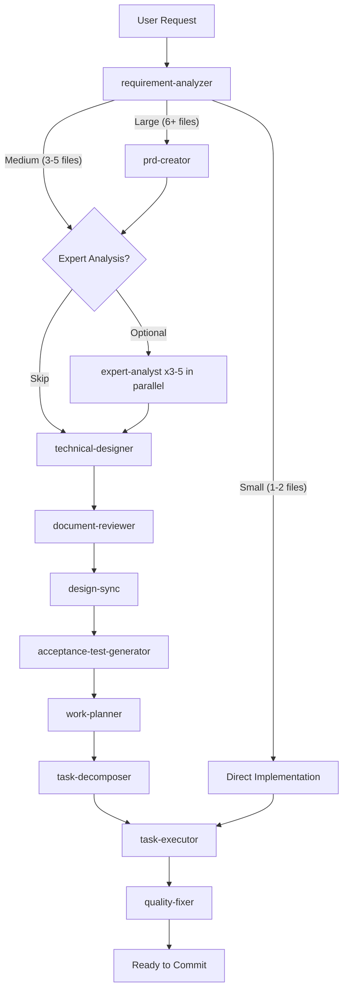

# Overture

[](https://claude.ai/code)
[](https://opensource.org/licenses/MIT)

**Build production-ready software with Claude Code** - Workflow plugins that bring best practices, specialized agents, and automated quality checks to your development process.

---

## Quick Start

This marketplace includes four workflow plugins:

- **backend-overture** - Node.js/TypeScript backend development
- **frontend-overture** - React/TypeScript frontend development
- **fullstack-overture** - Full-stack development (backend + frontend)
- **gamedev-overture** - Game development with Phaser 3/TypeScript

### Backend Development (Node.js/TypeScript)

```bash
# 1. Start Claude Code
claude

# 2. Install the marketplace
/plugin marketplace add tundraray/overture

# 3. Install backend plugin
/plugin install backend-overture@overture

# 4. Restart session (required)
# Exit and restart Claude Code

# 5. Start building
/implement <your feature>
```

### Frontend Development (React/TypeScript)

```bash
# 1-2. Same as above (start Claude Code and add marketplace)

# 3. Install frontend plugin
/plugin install frontend-overture@overture

# 4-5. Same as above (restart and start building)

# Use frontend-specific commands
/front-design <your feature>
```

### Full-Stack Development

```bash
# Install the fullstack plugin (includes both backend and frontend)
/plugin install fullstack-overture@overture
```

Or install backend + frontend separately for more control.

### Game Development (Phaser 3/TypeScript)

```bash
# 1-2. Same as above (start Claude Code and add marketplace)

# 3. Install gamedev plugin
/plugin install gamedev-overture@overture

# 4-5. Same as above (restart and start building)

# Build a game
/implement <your game concept>
```

> **Note**: If you encounter SSH errors during installation, see [FAQ](docs/overture/faq.md#ssh-authentication-error-during-plugin-installation).
>
> **Windows users**: This plugin uses symlinks. Before installing, enable symlink support in Git:
> ```bash
> git config --global core.symlinks true
> ```
> This is required for plugin installation via `/plugin install` to work correctly.

---

## How It Works



The plugin analyzes your request, scales the workflow to match complexity, and delegates to specialized agents -- each with fresh context and enforced best practices. The gamedev plugin extends this with game-specific phases (market analysis, GDD, art direction, analytics). See [all workflow diagrams](docs/overture/workflows.md).

---

## Commands

### Backend (backend-overture)

| Command | Purpose |
|---------|---------|
| `/implement` | End-to-end feature development |
| `/task` | Single task with precision |
| `/diagnose` | Root cause analysis |
| `/reverse-engineer` | Generate docs from existing code |

[All backend commands](docs/overture/commands.md#backend-development-backend-overture)

### Frontend (frontend-overture)

| Command | Purpose |
|---------|---------|
| `/front-design` | Frontend design docs |
| `/front-build` | Execute React implementation |
| `/task` | Single task with precision |
| `/diagnose` | Root cause analysis |

[All frontend commands](docs/overture/commands.md#frontend-development-frontend-overture)

### Game Development (gamedev-overture)

| Command | Purpose |
|---------|---------|
| `/implement` | End-to-end game development with market analysis, GDD, and 6-phase planning |
| `/task` | Single task with precision |
| `/diagnose` | Root cause analysis |
| `/design` | Create design documentation |

[All gamedev commands](docs/overture/commands.md#game-development-gamedev-overture)

---

## Expert Plugins

Standalone skill plugins that give Claude Code deep domain expertise:

| Plugin | Domain | Description |
|--------|--------|-------------|
| [**javascript-expert**](docs/experts/javascript.md) | Language | ES2024+, async patterns, Node.js 22+, V8 internals, security |
| [**nestjs-expert**](docs/experts/nestjs.md) | Backend | Enterprise NestJS architecture, DI, CQRS, database patterns |
| [**nextjs-developer**](docs/experts/nextjs.md) | Frontend | App Router, RSC, caching architecture, deployment |
| [**playwright-expert**](docs/experts/playwright.md) | Quality | E2E test architecture, Page Object Model, CI optimization |
| [**postgres-expert**](docs/experts/postgres.md) | Infrastructure | Query planner, partitioning, replication, security hardening |

Install any expert plugin:

```bash
/plugin marketplace add tundraray/overture
/plugin install <plugin-name>@overture
```

---

## Why Use These Plugins?

### The Problem

When building with AI coding assistants, you often run into:

- Context gets exhausted in long sessions
- Code quality drops over time
- Patterns become inconsistent
- You end up fixing test failures and type errors manually

### The Solution

These plugins fix that by:

- **Fresh context for each phase** - Specialized agents handle different parts without context exhaustion
- **Enforced best practices** - Language-agnostic rules (backend) and React patterns (frontend) keep quality consistent
- **Automated quality checks** - Tests, types, and linting run automatically and get fixed if they fail
- **Complete lifecycle** - From requirements to implementation to review

### Frontend-Specific Benefits

The frontend plugin is built specifically for React development:

- Component architecture planning with state management decisions
- React Testing Library integration from the start
- TypeScript-first approach with automatic type generation
- Handles build errors, test failures, and type issues automatically

### Gamedev-Specific Benefits

The gamedev plugin is built for game development with Phaser 3:

- Market analysis with Go/No-Go gate before committing to a project
- GDD (Game Design Document) as first-class artifact driving all design decisions
- 12 specialized game agents: designers, mechanics engineer, game feel developer, artists, QA, analytics
- 6-phase work planning: Core Mechanics → Game Feel → Art → UI → Analytics → QA
- Three development modes: Full Development, Design Only, Prototype

---

## Documentation

### Overture Plugins

- [Workflows](docs/overture/workflows.md) - All workflow diagrams and how they work
- [Commands](docs/overture/commands.md) - Complete command reference
- [Agents](docs/overture/agents.md) - All specialized agents
- [Skills](docs/overture/skills.md) - Knowledge modules loaded by agents
- [Examples](docs/overture/examples.md) - Real-world examples and typical workflows
- [Architecture](docs/overture/architecture.md) - Repository structure
- [FAQ](docs/overture/faq.md) - Common questions and SSH setup
- [Gamedev Workflows](docs/overture/gamedev-workflows.md) - Game development workflow diagrams

### Expert Plugins

- [JavaScript Expert](docs/experts/javascript.md)
- [NestJS Expert](docs/experts/nestjs.md)
- [Next.js Developer](docs/experts/nextjs.md)
- [Playwright Expert](docs/experts/playwright.md)
- [PostgreSQL Expert](docs/experts/postgres.md)

---

## Acknowledgments

Special thanks to [Shinsuke Kagawa](https://github.com/shinpr) for creating the original Claude Code Workflows -- an excellent foundation for building production-ready software with Claude Code. The well-designed agent orchestration architecture and comprehensive workflow system made this project possible.

---

## License

MIT License - Free to use, modify, and distribute.

See [LICENSE](LICENSE) for full details.
