# Claude Code Workflows 🚀

*Forked from [shinpr/claude-code-workflows](https://github.com/shinpr/claude-code-workflows)*

[](https://claude.ai/code)
[](https://opensource.org/licenses/MIT)

**Build production-ready software with Claude Code** - Workflow plugins that bring best practices, specialized agents, and automated quality checks to your development process.

---

## ⚡ Quick Start

This marketplace includes two plugins:

- **node-workflow** - Node.js/TypeScript backend development
- **react-workflow** - React/TypeScript frontend development

Choose what fits your project:

### Backend Development (Node.js/TypeScript)

```bash
# 1. Start Claude Code
claude

# 2. Install the marketplace
/plugin marketplace add tundraray/claude-code-workflows

# 3. Install backend plugin
/plugin install node-workflow@claude-code-workflows

# 4. Restart session (required)
# Exit and restart Claude Code

# 5. Start building
/implement <your feature>
```

### Frontend Development (React/TypeScript)

```bash
# 1-2. Same as above (start Claude Code and add marketplace)

# 3. Install frontend plugin
/plugin install react-workflow@claude-code-workflows

# 4-5. Same as above (restart and start building)

# Use frontend-specific commands
/front-design <your feature>
```

### Full-Stack Development

Install both plugins to get the complete toolkit for backend and frontend work.

> **Note**: If you encounter SSH errors during installation, see [SSH Setup FAQ](#ssh-authentication-error-during-plugin-installation) below.
>
> **Windows users**: This plugin uses symlinks. Before installing, enable symlink support in Git:
> ```bash
> git config --global core.symlinks true
> ```
> This is required for plugin installation via `/plugin install` to work correctly.

---

## 🔧 How It Works

### The Workflow


### The Diagnosis Workflow

```mermaid
graph LR
    P[🐛 Problem] --> INV[🔍 investigator]
    INV --> |Evidence Matrix| ASS{Complex?}
    ASS --> |Yes| VER[⚖️ verifier]
    ASS --> |No| SOL[💡 solver]
    VER --> |Validated Conclusion| SOL
    SOL --> |Solutions + Steps| R[📋 Report]
```



### The Reverse Engineering Workflow

```mermaid
graph TB
    subgraph Phase1[Phase 1: PRD Generation]
        CMD[📜 /reverse-engineer] --> SD1[🔍 scope-discoverer]
        SD1 --> PRD[📄 prd-creator]
        PRD --> CV1[✅ code-verifier]
        CV1 --> DR1[📋 document-reviewer]
    end

    subgraph Phase2[Phase 2: Design Doc Generation]
        SD2[🔍 scope-discoverer] --> DD[📐 technical-designer]
        DD --> CV2[✅ code-verifier]
        CV2 --> DR2[📋 document-reviewer]
        DR2 --> DONE[📚 Complete]
    end

    DR1 --> |All PRDs Approved| SD2
```



### What Happens Behind the Scenes

1. **Analysis** - Figures out how complex your task is
2. **Planning** - Creates the right docs (PRD, design doc, work plan) based on complexity
3. **Execution** - Specialized agents handle implementation autonomously
4. **Quality** - Runs tests, checks types, fixes errors automatically
5. **Review** - Makes sure everything matches the design
6. **Done** - Clean, production-ready code

---

## ⚡ Workflow Commands

### Backend Development (node-workflow)

| Command | Purpose | When to Use |
|---------|---------|-------------|
| `/implement` | End-to-end feature development | New features, complete workflows |
| `/task` | Execute single task with precision | Bug fixes, small changes |
| `/design` | Create design documentation | Architecture planning |
| `/plan` | Generate work plan from design | Planning phase |
| `/build` | Execute from existing task plan | Resume implementation |
| `/review` | Verify code against design docs | Post-implementation check |
| `/diagnose` | Investigate problems and derive solutions | Bug investigation, root cause analysis |
| `/reverse-engineer` | Generate PRD/Design Docs from existing code | Legacy system documentation, codebase understanding |
| `/add-integration-tests` | Add integration/E2E tests to existing code | Test coverage for existing implementations |
| `/project-context` | Initialize project-context skill | New project setup |
| `/refine-skill` | Improve and refine existing skills | Skill optimization |
| `/sync-skills` | Synchronize skills across plugins | Skill management |

### Frontend Development (react-workflow)

| Command | Purpose | When to Use |
|---------|---------|-------------|
| `/front-design` | Create frontend design docs | React component architecture |
| `/front-plan` | Generate frontend work plan | Component breakdown planning |
| `/front-build` | Execute frontend task plan | Resume React implementation |
| `/front-review` | Verify code against design docs | Post-implementation check |
| `/front-reverse-design` | Generate frontend Design Docs from existing code using PRD | Frontend component documentation |
| `/task` | Execute single task with precision | Component fixes, small updates |
| `/diagnose` | Investigate problems and derive solutions | Bug investigation, root cause analysis |
| `/project-context` | Initialize project-context skill | New project setup |
| `/brand-context` | Initialize brand-system-guide skill | Brand/design system setup |
| `/refine-skill` | Improve and refine existing skills | Skill optimization |
| `/sync-skills` | Synchronize skills across plugins | Skill management |

> **Tip**: Both plugins share `/task`, `/diagnose`, `/project-context`, `/refine-skill`, and `/sync-skills`. `/brand-context` is only in react-workflow. For reverse engineering, use `/reverse-engineer` (node-workflow) to generate PRD, then `/front-reverse-design` (react-workflow) to generate frontend Design Docs from that PRD.

---

## 📦 Specialized Agents

### Shared Agents (Available in Both Plugins)

These agents work the same way whether you're building a REST API or a React app:

| Agent | What It Does |
|-------|--------------|
| **requirement-analyzer** | Figures out how complex your task is and picks the right workflow |
| **work-planner** | Breaks down design docs into actionable tasks |
| **task-decomposer** | Splits work into small, commit-ready chunks |
| **code-reviewer** | Checks your code against design docs to make sure nothing's missing |
| **document-reviewer** | Reviews single document quality, completeness, and rule compliance |
| **design-sync** | Verifies consistency across multiple Design Docs and detects conflicts |
| **investigator** | Collects evidence, enumerates hypotheses, builds evidence matrix for problem diagnosis |
| **verifier** | Validates investigation results using ACH and Devil's Advocate methods |
| **solver** | Generates solutions with tradeoff analysis and implementation steps |
| **scope-discoverer** | Discovers PRD/Design Doc targets from codebase for reverse engineering |
| **code-verifier** | Validates consistency between documentation and code implementation |

### Backend-Specific Agents (node-workflow)

| Agent | What It Does |
|-------|--------------|
| **prd-creator** | Writes product requirement docs for complex features |
| **technical-designer** | Plans architecture and tech stack decisions |
| **acceptance-test-generator** | Creates E2E and integration test scaffolds from requirements |
| **integration-test-reviewer** | Reviews integration/E2E tests for skeleton compliance and quality |
| **task-executor** | Implements backend features with TDD |
| **quality-fixer** | Runs tests, fixes type errors, handles linting - everything quality-related |
| **rule-advisor** | Picks the best coding rules for your current task |

### Frontend-Specific Agents (react-workflow)

| Agent | What It Does |
|-------|--------------|
| **prd-creator** | Writes product requirement docs for complex features |
| **technical-designer-frontend** | Plans React component architecture and state management |
| **ux-designer** | Creates UX Requirement Documentation (UXRD) with interaction patterns and accessibility specs |
| **task-executor-frontend** | Implements React components with Testing Library |
| **quality-fixer-frontend** | Handles React-specific tests, TypeScript checks, and builds |
| **rule-advisor** | Picks the best coding rules for your current task |
| **design-sync** | Verifies consistency across multiple Design Docs and detects conflicts |

---

## 📚 Skills (Best Practices)

Skills are knowledge modules that agents load automatically when relevant.

### node-workflow (10 skills)

| Skill | Description |
|-------|-------------|
| **ai-development-guide** | AI-assisted development patterns and anti-patterns |
| **coding-principles** | Code quality standards |
| **documentation-criteria** | PRD/ADR/Design Doc templates and criteria |
| **implementation-approach** | Design decisions and trade-offs |
| **integration-e2e-testing** | Integration and E2E test patterns |
| **project-context** | Project-specific context (customizable via `/project-context`) |
| **subagents-orchestration-guide** | Agent coordination rules |
| **task-analyzer** | Task complexity analysis |
| **technical-spec** | Technical design rules and build/testing commands |
| **testing-principles** | TDD, coverage, test patterns |

### react-workflow (13 skills)

All skills from node-workflow (except integration-e2e-testing) plus:

| Skill | Description |
|-------|-------------|
| **brand-system-guide** | Design system setup (customizable via `/brand-context`) |
| **frontend-ai-guide** | React-specific AI development patterns |
| **typescript-rules** | TypeScript best practices for React |
| **typescript-testing** | React Testing Library patterns |

---

## 🚀 Why Use These Plugins?

### The Problem

When building with AI coding assistants, you often run into:

- Context gets exhausted in long sessions
- Code quality drops over time
- Patterns become inconsistent
- You end up fixing test failures and type errors manually

### The Solution

These plugins fix that by:

- **Fresh context for each phase** - Specialized agents handle different parts without context exhaustion
- **Enforced best practices** - Language-agnostic rules (backend) and React patterns (frontend) keep quality consistent
- **Automated quality checks** - Tests, types, and linting run automatically and get fixed if they fail
- **Complete lifecycle** - From requirements to implementation to review

### Frontend-Specific Benefits

The frontend plugin is built specifically for React development:

- Component architecture planning with state management decisions
- React Testing Library integration from the start
- TypeScript-first approach with automatic type generation
- Handles build errors, test failures, and type issues automatically

---

## 💡 Real-World Examples

### What People Have Built

#### [Sub-Agents MCP Server](https://github.com/shinpr/sub-agents-mcp)
Built in 2 days - 30 TypeScript files with full test coverage, now running in production.

#### [MCP Image Generator](https://github.com/shinpr/mcp-image)
Built in 1.5 days - Complete creative tool with multi-image blending and character consistency.

> The right workflow structure + specialized agents = production-quality code at AI speed.

---

## 🎯 Typical Workflows

### Backend Feature Development

```bash
/implement "Add user authentication with JWT"

# What happens:
# 1. Analyzes your requirements
# 2. Creates design documents
# 3. Breaks down into tasks
# 4. Implements with TDD
# 5. Runs tests and fixes issues
# 6. Reviews against design docs
```

### Frontend Feature Development

```bash
/front-design "Build a user profile dashboard"

# What happens:
# 1. Plans React component structure
# 2. Defines state management approach
# 3. Creates work plan
#
# Then run:
/front-build

# This:
# 1. Implements components with Testing Library
# 2. Writes tests for each component
# 3. Handles TypeScript types
# 4. Fixes lint and build errors
```

### Quick Fixes (Both Plugins)

```bash
/task "Fix validation error message"

# Direct implementation with quality checks
# Works the same in both plugins
```

### Code Review

```bash
/review

# Checks your implementation against design docs
# Catches missing features or inconsistencies
```

### Problem Diagnosis (Both Plugins)

```bash
/diagnose "API returns 500 error on user login"

# What happens:
# 1. Investigator collects evidence from code, logs, git history
# 2. Builds evidence matrix with multiple hypotheses
# 3. Verifier validates findings with ACH and Devil's Advocate
# 4. Solver generates solutions with tradeoff analysis
# 5. Presents actionable implementation steps
```

### Reverse Engineering

**Backend (node-workflow):**

```bash
/reverse-engineer "src/auth module"

# What happens:
# 1. Discovers PRD targets (user value units) from code
# 2. Generates PRD for each feature
# 3. Verifies PRD against actual code
# 4. Reviews and revises until consistent
# 5. Discovers Design Doc targets (technical components)
# 6. Generates backend Design Docs with code verification
# 7. Produces complete documentation from existing code
```

**Frontend (react-workflow):**

```bash
# First, generate PRD using node-workflow's /reverse-engineer
# Then, generate frontend Design Docs from existing PRD:

/front-reverse-design "docs/prd/my-feature-prd.md"

# What happens:
# 1. Uses existing PRD as basis
# 2. Discovers frontend component targets
# 3. Generates frontend Design Docs with code verification
# 4. Reviews and revises until consistent
```

> If you're working with undocumented legacy code, these commands are designed to make it AI-friendly by generating PRD and design docs.
> For a quick walkthrough, see: [How I Made Legacy Code AI-Friendly with Auto-Generated Docs](https://dev.to/shinpr/how-i-made-legacy-code-ai-friendly-with-auto-generated-docs-4353)

---

## 📂 Repository Structure

```
claude-code-workflows/
├── .claude-plugin/
│   └── marketplace.json        # Manages both plugins
│
├── agents/                     # Shared agents (symlinked by both plugins)
│   ├── code-reviewer.md
│   ├── investigator.md         # Diagnosis workflow
│   ├── verifier.md             # Diagnosis workflow
│   ├── solver.md               # Diagnosis workflow
│   ├── scope-discoverer.md     # Reverse engineering workflow
│   ├── code-verifier.md        # Reverse engineering workflow
│   ├── ux-designer.md          # UX/UI design (frontend)
│   ├── task-executor.md
│   ├── technical-designer.md
│   └── ... (22 agents total)
│
├── commands/                   # Shared commands
│   ├── implement.md
│   ├── design.md
│   ├── diagnose.md             # Problem diagnosis
│   ├── reverse-engineer.md     # Reverse documentation
│   ├── project-context.md      # Project context initialization
│   ├── brand-context.md        # Brand system initialization
│   ├── plan.md
│   ├── build.md
│   └── ... (13 commands for backend, 9 for frontend)
│
├── skills/                     # Skills (auto-loaded by agents)
│   ├── ai-development-guide/
│   ├── coding-principles/
│   ├── testing-principles/
│   ├── implementation-approach/
│   ├── project-context/        # Project-specific context
│   ├── technical-spec/         # Technical design rules
│   ├── brand-system-guide/     # Brand design system
│   ├── typescript-rules/       # Frontend-specific
│   └── ... (14 skills total)
│
├── backend/                    # node-workflow plugin
│   ├── agents/                 # Symlinks to shared agents
│   ├── commands/               # Symlinks to shared commands
│   ├── skills/                 # Symlinks to shared skills (10 skills)
│   └── .claude-plugin/
│       └── plugin.json
│
├── frontend/                   # react-workflow plugin
│   ├── agents/                 # Symlinks to shared agents
│   ├── commands/               # Symlinks to shared commands
│   ├── skills/                 # Symlinks to shared skills (13 skills)
│   └── .claude-plugin/
│       └── plugin.json
│
├── LICENSE
└── README.md
```

---

## 🤔 FAQ

**Q: Which plugin should I install?**

A: Depends on what you're building:
- **Node.js backend, APIs, CLI tools** → Install `node-workflow`
- **React/TypeScript frontend** → Install `react-workflow`
- **Full-stack projects** → Install both

Both plugins can run side-by-side without conflicts.

**Q: Can I use both plugins at the same time?**

A: Yes! They're designed to work together. Install both if you're building a full-stack app.

**Q: Do I need to learn special commands?**

A: Not really. For backend, just use `/implement`. For frontend, use `/front-design`. The plugins handle everything else automatically.

**Q: What if there are errors?**

A: The quality-fixer agents (one in each plugin) automatically fix most issues like test failures, type errors, and lint problems. If something can't be auto-fixed, you'll get clear guidance on what needs attention.

**Q: SSH authentication error during plugin installation?**
A: Set up SSH keys for GitHub:

```bash
# 1. Check if SSH key already exists
ls ~/.ssh/id_ed25519.pub

# 2. Generate new SSH key (if needed)
ssh-keygen -t ed25519 -C "your_email@example.com"
# → Press Enter to save to default location
# → Enter a strong passphrase when prompted (recommended for security)

# 3. Add SSH key to ssh-agent
eval "$(ssh-agent -s)"
ssh-add ~/.ssh/id_ed25519

# 4. Copy public key to clipboard
cat ~/.ssh/id_ed25519.pub
# → Copy the output

# 5. Add to GitHub
# Go to https://github.com/settings/keys
# Click "New SSH key"
# Paste your public key and save

# 6. Test connection
ssh -T git@github.com
# → Should see: "Hi username! You've successfully authenticated..."
```

---

## 🙏 Acknowledgments

This project is a fork of [shinpr/claude-code-workflows](https://github.com/shinpr/claude-code-workflows).

Special thanks to [Shinsuke Kagawa](https://github.com/shinpr) for creating the original Claude Code Workflows — an excellent foundation for building production-ready software with Claude Code. The well-designed agent orchestration architecture and comprehensive workflow system made this project possible.

---

## 📄 License

MIT License - Free to use, modify, and distribute.

See [LICENSE](LICENSE) for full details.

---

**Happy Coding with Claude Code Workflows!** 🚀✨