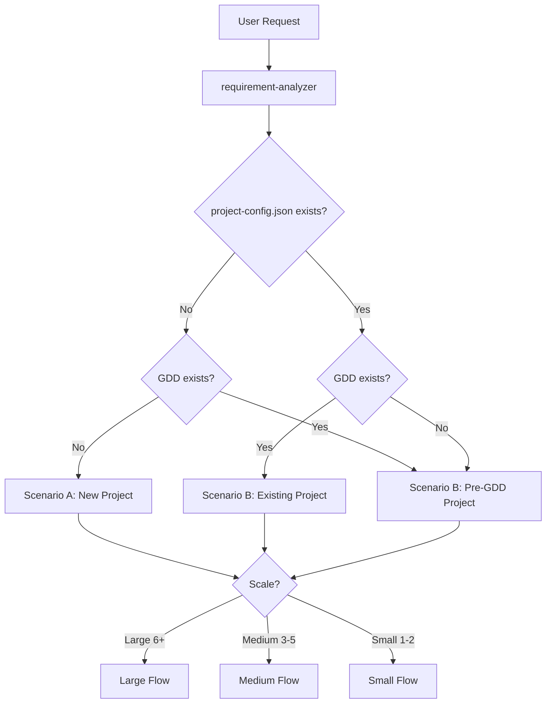
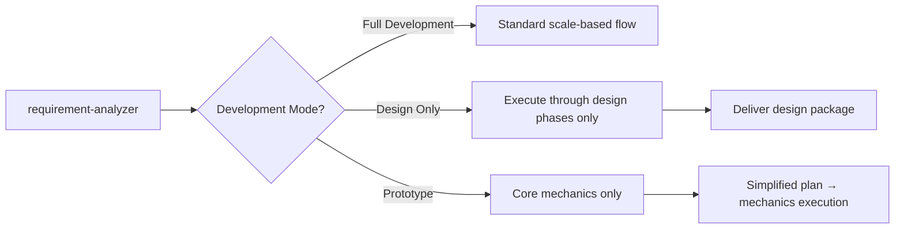
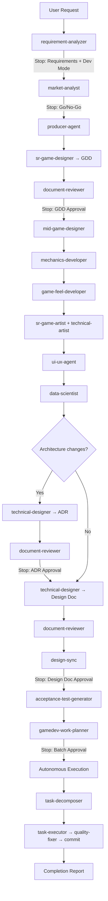
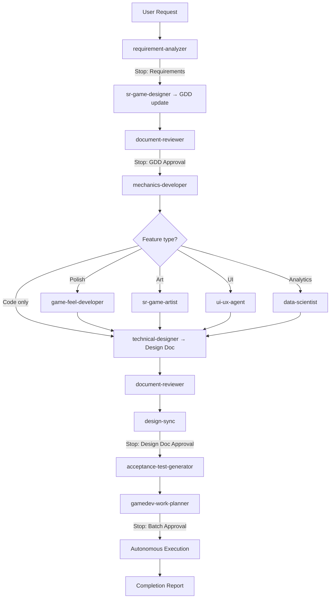
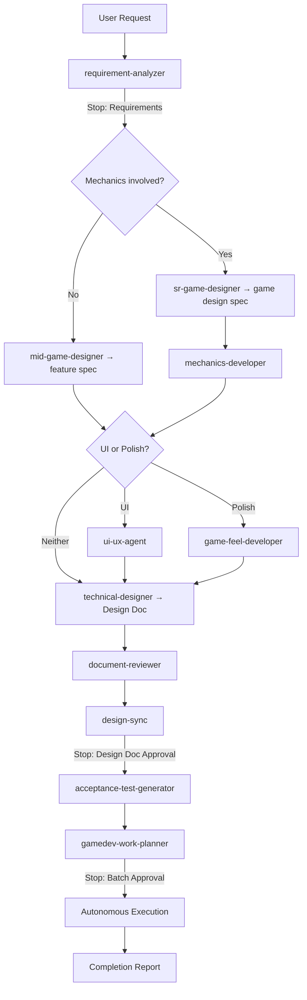
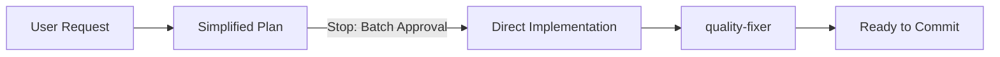
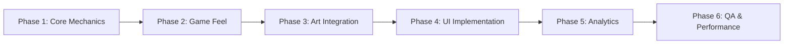
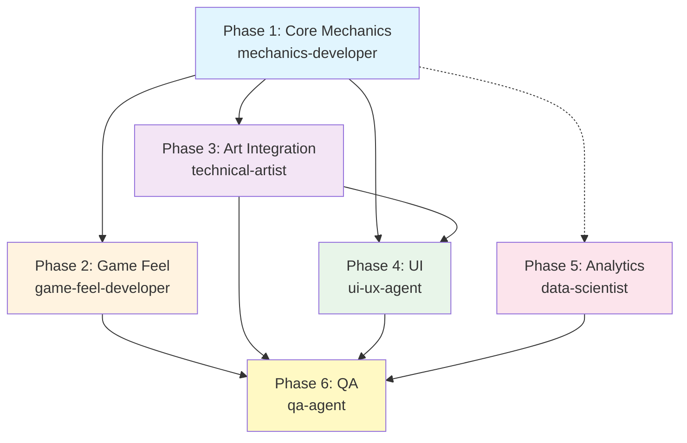
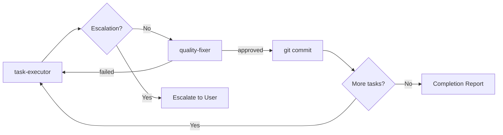
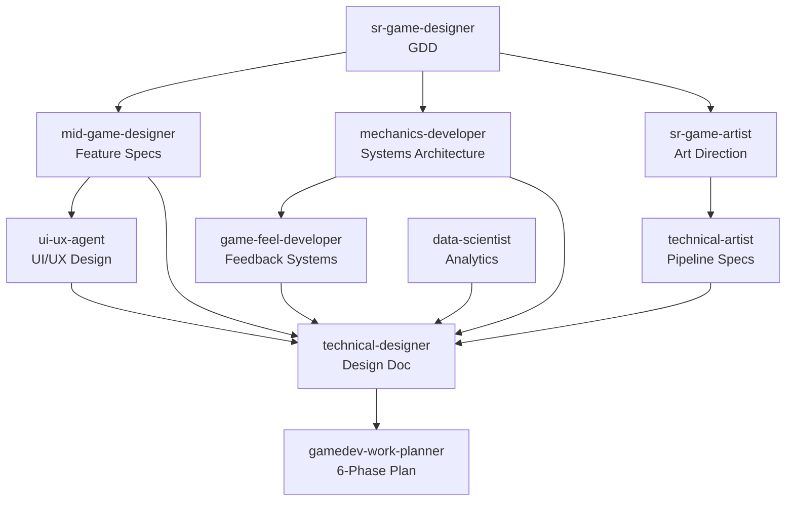

# Gamedev Workflows

Detailed workflow diagrams for the gamedev-overture plugin. These extend the [shared overture workflows](workflows.md) with game-specific phases and agents.

---

## Scenario Detection

When you run `/implement`, the requirement-analyzer inspects your project to determine the right workflow path. Two factors drive routing: **scenario** (new vs existing project) and **scale** (number of files affected).

**Detection logic**:
- If no `project-config.json` and no GDD exist — **Scenario A: New Project**. Full pipeline including market analysis and GDD creation from scratch
- If a GDD already exists — **Scenario B: Existing Project**. Skip market analysis, update the existing GDD for the new feature
- If `project-config.json` exists but no GDD — **Pre-GDD Project**. Treated as Scenario B (the project exists but design hasn't started)

After scenario detection, scale determines the depth of the design pipeline: Large (6+), Medium (3-5), or Small (1-2 files).

---

## Development Modes

The requirement-analyzer also determines the development mode based on your request. This controls how far the pipeline runs.

- **Full Development** — Standard scale-based flow. Goes from design through implementation and quality checks. Use for production features
- **Design Only** — Executes design phases (market analysis, GDD, art direction, mechanics architecture) but stops before implementation. Delivers a design package you can implement later or hand off to another team
- **Prototype** — Minimal pipeline focused on getting a playable core loop fast. Skips market analysis, art direction, and analytics. Creates a simplified plan targeting mechanics execution only

---

## Large Scale — Scenario A: New Project

The most comprehensive flow. Used when creating a new game from scratch with 6+ files expected. Covers the full lifecycle from market research to deployment-ready code.

**Key characteristics**:
- Market analysis with explicit Go/No-Go gate — if market conditions are unfavorable, the workflow stops here
- GDD is created from scratch by sr-game-designer, establishing vision, pillars, core loop, and progression
- All 12 specialist agents contribute their domain (mechanics, game feel, art, UI, analytics)
- Conditional ADR if architecture changes are needed (new frameworks, data flow redesigns)
- 5 stop points for user approval throughout the pipeline

**Agent sequence**:
1. requirement-analyzer → scope, requirements, development mode selection
2. market-analyst → market size, competitors, monetization, Go/No-Go recommendation
3. producer-agent → project config, team selection, resource plan
4. sr-game-designer → GDD (vision, pillars, core loop, progression)
5. document-reviewer → GDD quality review
6. mid-game-designer → feature specs with user stories, acceptance criteria, balancing
7. mechanics-developer → systems architecture (state machines, physics, events)
8. game-feel-developer → feedback systems (screen shake, particles, audio, tweens)
9. sr-game-artist + technical-artist → art direction, pipeline specs, atlas optimization
10. ui-ux-agent → HUD, menus, interaction patterns, accessibility
11. data-scientist → analytics design, KPIs, A/B test framework
12. technical-designer → Design Doc integrating all specialist outputs
13. gamedev-work-planner → 6-phase plan with dependencies
14. Autonomous execution: task-decomposer → (task-executor → quality-fixer → commit) loop

---

## Large Scale — Scenario B: Large Feature (Existing Project)

Used when adding a major feature (6+ files) to an existing project that already has a GDD. Skips market analysis and project setup — goes straight to updating the GDD.

**Key differences from Scenario A**:
- No market analysis or producer-agent — the project already exists
- GDD is updated (not created) to incorporate the new feature
- Specialist agents are conditional based on feature type — a pure code feature won't involve sr-game-artist, a UI feature won't need mechanics-developer
- Fewer stop points since project context is already established

**Feature-type routing**: After mechanics-developer, the workflow branches based on what the feature involves:
- **Polish** → game-feel-developer (screen shake, particles, audio feedback)
- **Art** → sr-game-artist (new visual assets, style changes)
- **UI** → ui-ux-agent (new screens, HUD elements, menu changes)
- **Analytics** → data-scientist (new event tracking, KPI dashboards)
- **Code only** → straight to technical-designer

---

## Medium Scale (3-5 Files)

For mid-size features — enough complexity to need a design doc but not a full PRD or market analysis. Common for adding a new game system, a UI screen, or a set of related mechanics.

**How it works**:

1. requirement-analyzer determines scope
2. **Mechanics check** — if the feature involves new game mechanics, sr-game-designer creates a game design spec and mechanics-developer architects the systems. If no new mechanics, mid-game-designer creates a feature specification
3. **UI/Polish check** — if the feature involves UI changes, ui-ux-agent handles it. If polish/game feel, game-feel-developer handles it. If neither, skip to design doc
4. technical-designer produces the Design Doc, reviewed and synced
5. gamedev-work-planner creates a phased plan, then autonomous execution

---

## Small Scale (1-2 Files)

For quick changes — bug fixes, parameter tweaks, single-file additions. Same as the shared overture small scale flow. No design documents, no specialist agents.

**How it works**:

1. A simplified plan is generated directly from the request
2. You approve the plan (single stop point)
3. Direct implementation with quality-fixer validating tests, types, and lint

**When to use**: Bug fixes, config changes, balancing tweaks, single scene modifications, adding a simple sound effect.

---

## 6-Phase Game Work Planning

The gamedev-work-planner organizes tasks into 6 game-specific phases instead of the generic Foundation → Core → Integration → QA used in backend/frontend. Each phase targets a specific aspect of game development and is assigned to the relevant specialist agent.

| Phase | Focus | Primary Agent | Output |
|-------|-------|---------------|--------|
| **Phase 1: Core Mechanics** | Game systems, state machines, physics, input handling, object pooling | mechanics-developer | Playable game logic |
| **Phase 2: Game Feel** | Screen shake, particles, audio cues, tweens, visual feedback | game-feel-developer | Polished interactions |
| **Phase 3: Art Integration** | Asset pipeline, texture atlases, shaders, sprite animations | technical-artist | Visual assets in-engine |
| **Phase 4: UI Implementation** | HUD, menus, game flow screens, transitions | ui-ux-agent | Complete game interface |
| **Phase 5: Analytics** | Event tracking, dashboards, A/B test framework, KPIs | data-scientist | Telemetry pipeline |
| **Phase 6: QA & Performance** | Test plans, performance profiling, memory audits, playtesting | qa-agent | Release-ready validation |

### Phase Dependencies

Phases don't always run strictly sequentially. Some can overlap based on their actual dependencies:

- **Phase 2 (Game Feel)** depends on Phase 1 — needs game systems to attach feedback to
- **Phase 3 (Art)** can partially parallel Phase 1 — asset pipeline setup is independent of game logic
- **Phase 4 (UI)** depends on Phase 1 (game state to display) and Phase 3 (visual assets for UI elements)
- **Phase 5 (Analytics)** can parallel Phases 3-4 — event schema design is independent of visuals
- **Phase 6 (QA)** depends on all previous phases but can start performance baselines early

---

## Per-Task Quality Cycle

Every task in every phase goes through the same quality cycle. This is the shared overture pattern — identical across backend, frontend, and gamedev.

**Cycle for each task**:

1. **task-executor** implements the task following the Design Doc and task specification
2. **Escalation check** — if the task requires design deviations (interface changes, new dependencies, layer violations), execution stops and escalates to the user
3. **quality-fixer** runs tests, type checks, and linting. If anything fails, it fixes the issues automatically. If fixes fail, the task loops back to task-executor
4. **git commit** — on success, the task is committed (strategy chosen by user: per-task, per-phase, per-feature, or manual)
5. Move to the next task or produce a completion report

---

## Agent Communication Flow

Shows how information flows between game specialist agents during the design phase. Each agent's output feeds into the next, ultimately converging at technical-designer who integrates everything into the Design Doc.

**Information flow**:
- **sr-game-designer** (GDD) is the source of truth — feeds into mid-game-designer, mechanics-developer, and sr-game-artist
- **mid-game-designer** (Feature Specs) provides detailed requirements to ui-ux-agent and technical-designer
- **mechanics-developer** (Systems Architecture) feeds into game-feel-developer (needs systems to attach feedback to) and technical-designer
- **sr-game-artist** (Art Direction) feeds into technical-artist (implements the art pipeline)
- All specialist outputs converge at **technical-designer** who produces the integrated Design Doc
- Design Doc feeds into **gamedev-work-planner** for 6-phase task breakdown

