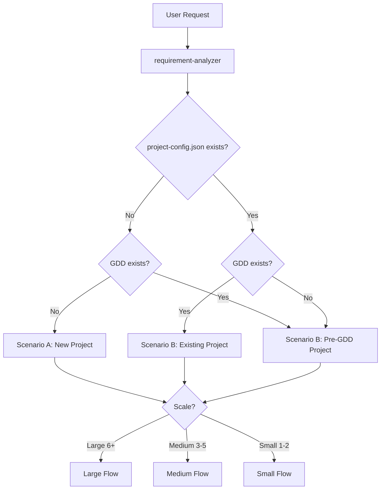
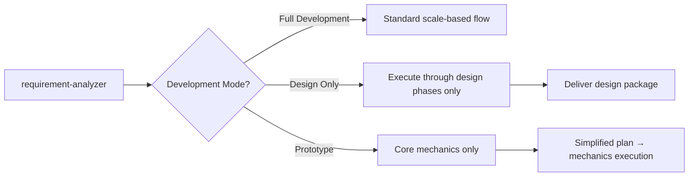
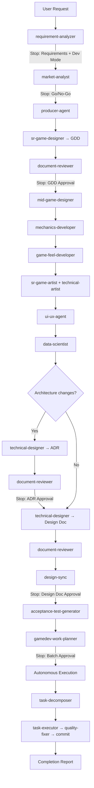
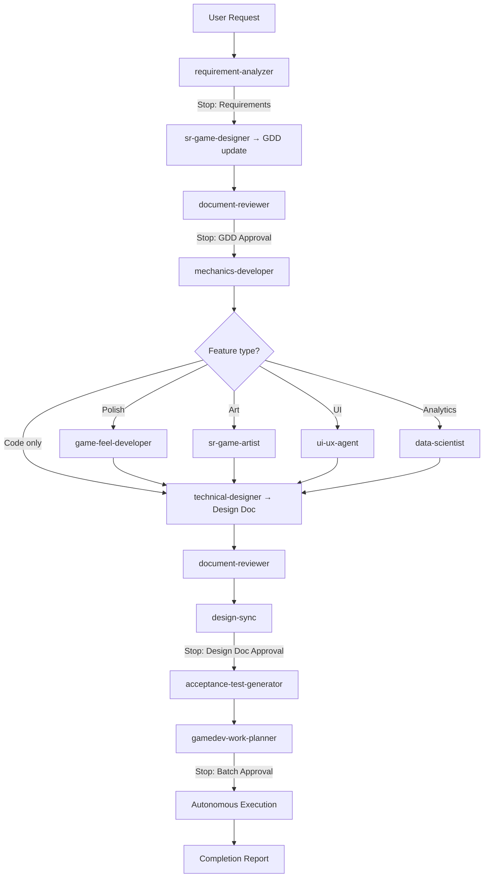
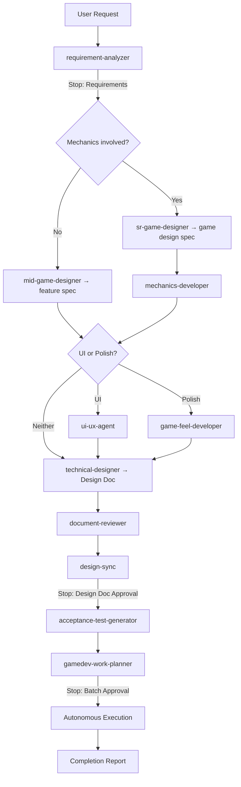
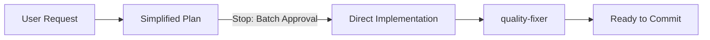
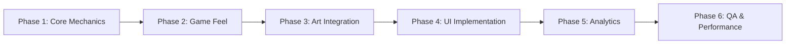
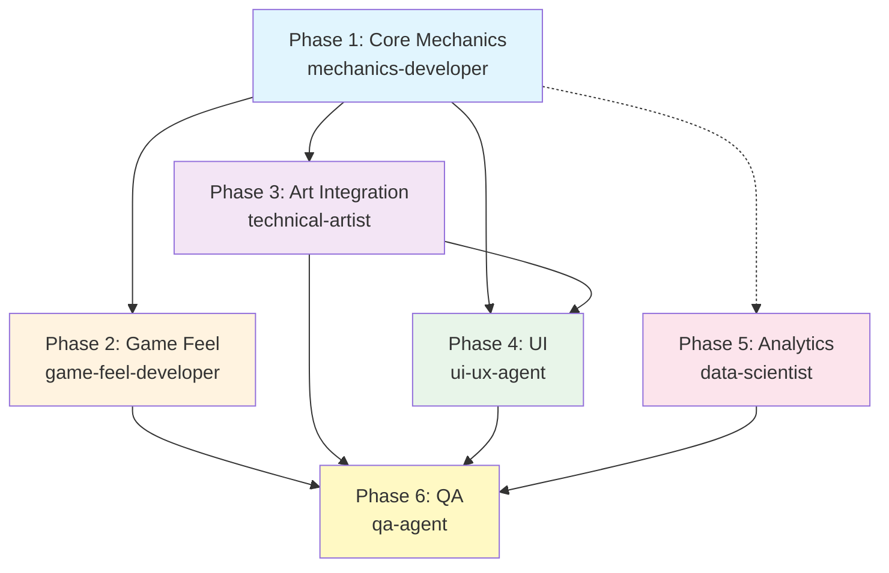
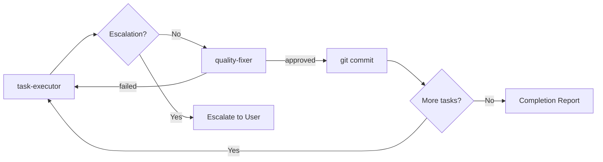
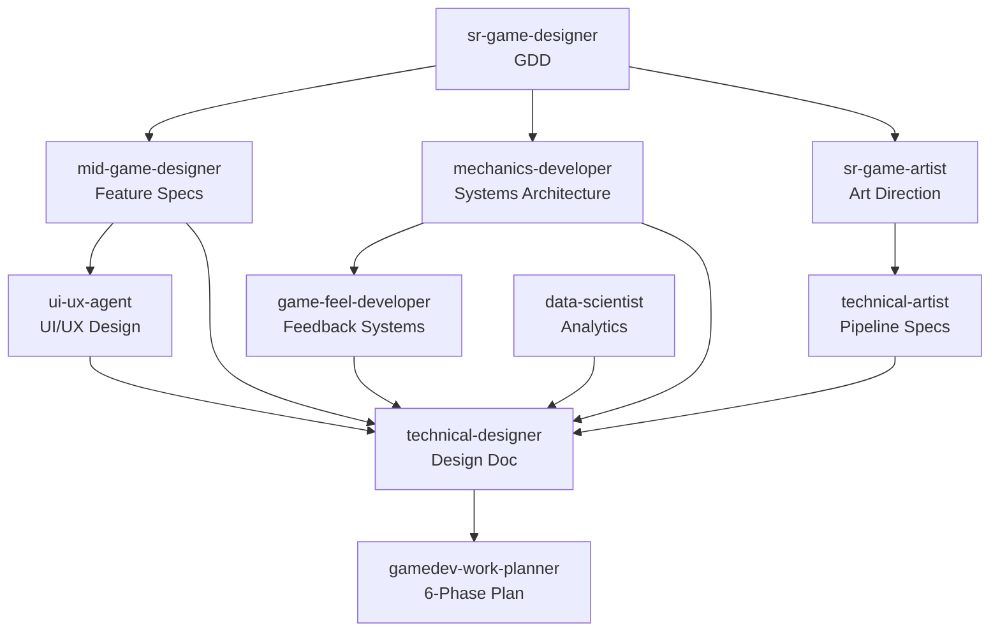

# Gamedev Workflows

## Scenario Detection

## Development Modes

## Large Scale — Scenario A: New Project

## Large Scale — Scenario B: Large Feature (Existing Project)

## Medium Scale (3-5 Files)

## Small Scale (1-2 Files)

## 6-Phase Game Work Planning

### Phase Dependencies

- Phase 2 (Game Feel) depends on Phase 1 — needs systems to attach feedback to
- Phase 3 (Art) can partially parallel Phase 1 — asset pipeline is independent
- Phase 4 (UI) depends on Phase 1 (game state) and Phase 3 (visual assets)
- Phase 5 (Analytics) can parallel Phases 3-4 — event schema is independent
- Phase 6 (QA) depends on all previous phases but can start performance baselines early

## Per-Task Quality Cycle

Same as the shared overture pattern:

## Agent Communication Flow

