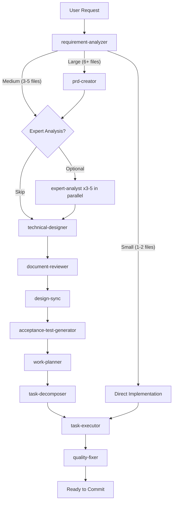
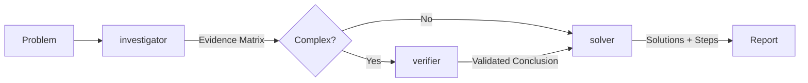
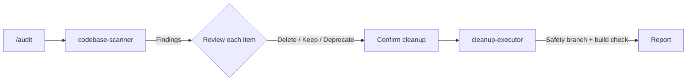
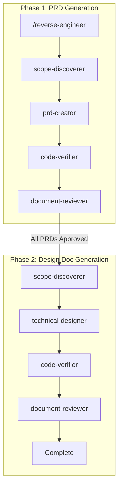
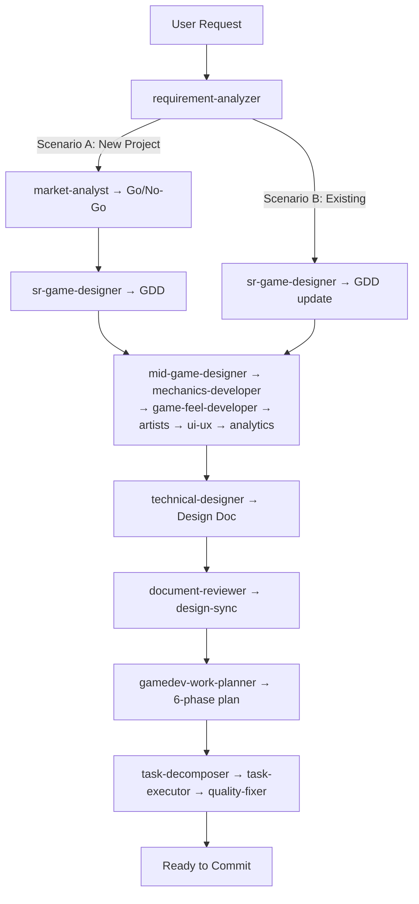

# Overture Workflows

## The Implementation Workflow

The main workflow triggered by `/implement`. Analyzes your request, determines complexity, and routes through the appropriate agent pipeline.

**Command**: `/implement <feature description>`

**How it works**:

1. **requirement-analyzer** parses your request and determines scale by estimating the number of files affected
2. Based on scale, the workflow branches:
   - **Large (6+ files)** — Full document pipeline: PRD for business requirements, then design doc, work plan, and phased implementation
   - **Medium (3-5 files)** — Design doc and work plan, skipping the PRD phase
   - **Small (1-2 files)** — Direct implementation without planning documents
3. **Expert analysis** (optional) — For complex tasks, 3-5 expert-analyst agents evaluate the problem in parallel from different perspectives before design begins
4. **technical-designer** produces the Design Doc with interfaces, contracts, and acceptance criteria
5. **document-reviewer** and **design-sync** verify document quality and cross-document consistency
6. **acceptance-test-generator** creates test skeletons from the acceptance criteria
7. **work-planner** breaks the work into phased tasks with dependencies
8. **task-decomposer** splits phases into single-commit tasks, then **task-executor** and **quality-fixer** handle each task autonomously

**Stop points** (workflow pauses for your approval):
- After requirement-analyzer — confirm scope and requirements
- After document-reviewer — approve PRD (large scale only)
- After design-sync — approve Design Doc
- After work-planner — batch-approve the implementation plan

After batch approval, execution is fully autonomous until completion or escalation.

---

## The Diagnosis Workflow

Root cause analysis for bugs, errors, and unexpected behavior. Uses a multi-agent investigation pipeline that gathers evidence before proposing solutions.

**Command**: `/diagnose <problem description>`

**How it works**:

1. **investigator** examines the codebase, logs, and error messages to build an evidence matrix — a structured collection of facts, hypotheses, and confidence levels
2. Based on complexity, the workflow branches:
   - **Complex problems** — **verifier** independently validates the investigator's conclusions, eliminating false leads and confirming root causes
   - **Simple problems** — Skip directly to solver
3. **solver** takes the validated conclusions and produces actionable solutions with step-by-step implementation guidance

**When to use**:
- Bugs that aren't obvious from the stack trace
- Performance issues with unclear bottlenecks
- Flaky tests or intermittent failures
- Behavior that doesn't match expectations

---

## The Audit Workflow

Interactive dead code detection and cleanup. Scans the codebase for unused exports, orphaned files, and dead code paths, then lets you decide what to do with each finding.

**Command**: `/audit`

**How it works**:

1. **codebase-scanner** performs static analysis to identify unused exports, unreachable code, orphaned files, and deprecated patterns
2. You review each finding interactively and decide: **delete**, **keep** (with justification), or **deprecate** (mark for future removal)
3. After confirmation, **cleanup-executor** applies the approved changes on a safety branch, runs the full build and test suite, and reports results

**Safety guarantees**:
- All changes happen on a separate branch
- Build and tests must pass before the branch is considered clean
- Nothing is deleted without your explicit approval per item

---

## The Reverse Engineering Workflow

Generates documentation from existing code. Useful when you inherit a codebase without docs or need to formalize undocumented features.

**Command**: `/reverse-engineer`

**How it works**:

The workflow runs in two phases with a gate between them:

**Phase 1 — PRD Generation**:
1. **scope-discoverer** analyzes the codebase to identify features, boundaries, and dependencies
2. **prd-creator** generates a PRD (Product Requirements Document) describing what the code does in business terms
3. **code-verifier** validates the PRD against actual code behavior — ensures claims match reality
4. **document-reviewer** reviews the PRD for completeness and accuracy

**Gate**: All PRDs must be approved before Phase 2 begins.

**Phase 2 — Design Doc Generation**:
1. **scope-discoverer** re-analyzes with focus on technical architecture
2. **technical-designer** generates a Design Doc with interfaces, data flows, and component relationships
3. **code-verifier** validates technical accuracy against the actual implementation
4. **document-reviewer** reviews the Design Doc

**Output**: Production-quality PRD and Design Doc that accurately reflect the existing codebase.

---

## The Gamedev Implementation Workflow

Extended implementation workflow for game development with Phaser 3. Adds market analysis, GDD-driven design, and 12 specialized game agents on top of the shared pipeline.

**Command**: `/implement <game feature or concept>`

**How it works**:

The workflow detects the project context and branches into two scenarios:

- **Scenario A (New Project)** — No existing GDD or project config. Full pipeline: market analysis with Go/No-Go gate, GDD creation, art direction, mechanics architecture, analytics design, then standard implementation
- **Scenario B (Existing Project)** — GDD already exists. Updates the GDD for the new feature, runs relevant specialist agents based on feature type, then standard implementation

**Game-specific phases** (not present in backend/frontend):
- **Market analysis** — competitor research, target audience, monetization strategy, Go/No-Go recommendation
- **GDD creation/update** — game vision, core loop, progression systems, balancing parameters
- **Specialist agents** — mechanics-developer, game-feel-developer, sr-game-artist, technical-artist, ui-ux-agent, data-scientist each contribute their domain expertise
- **6-phase work planning** — tasks organized by game development phases instead of generic Foundation/Core/Integration/QA

See [detailed gamedev workflow diagrams](gamedev-workflows.md) for all scale variants, scenario detection, development modes, and phase dependencies.

