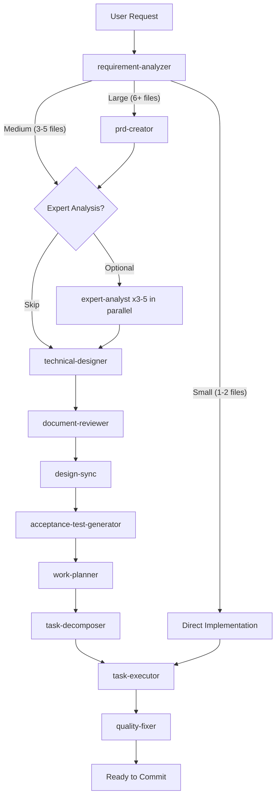
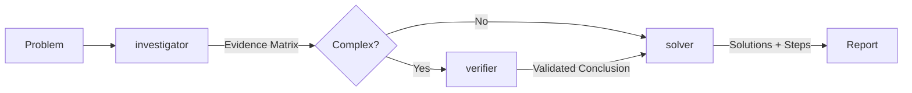

# Overture Workflows

## The Implementation Workflow



## The Diagnosis Workflow



## The Audit Workflow

```mermaid
graph LR
    A[/audit] --> S[codebase-scanner]
    S --> |Findings| R{Review each item}
    R --> |Delete / Keep / Deprecate| C[Confirm cleanup]
    C --> X[cleanup-executor]
    X --> |Safety branch + build check| D[Report]
```

## The Reverse Engineering Workflow

```mermaid
graph TB
    subgraph Phase1[Phase 1: PRD Generation]
        CMD[/reverse-engineer] --> SD1[scope-discoverer]
        SD1 --> PRD[prd-creator]
        PRD --> CV1[code-verifier]
        CV1 --> DR1[document-reviewer]
    end

    subgraph Phase2[Phase 2: Design Doc Generation]
        SD2[scope-discoverer] --> DD[technical-designer]
        DD --> CV2[code-verifier]
        CV2 --> DR2[document-reviewer]
        DR2 --> DONE[Complete]
    end

    DR1 --> |All PRDs Approved| SD2
```

## What Happens Behind the Scenes

1. **Analysis** - Figures out how complex your task is
2. **Expert Analysis** - (Optional) Parallel multi-perspective evaluation before design
3. **Planning** - Creates the right docs (PRD, design doc, work plan) based on complexity
4. **Execution** - Specialized agents handle implementation autonomously
5. **Quality** - Runs tests, checks types, fixes errors automatically
6. **Review** - Makes sure everything matches the design
7. **Done** - Clean, production-ready code
