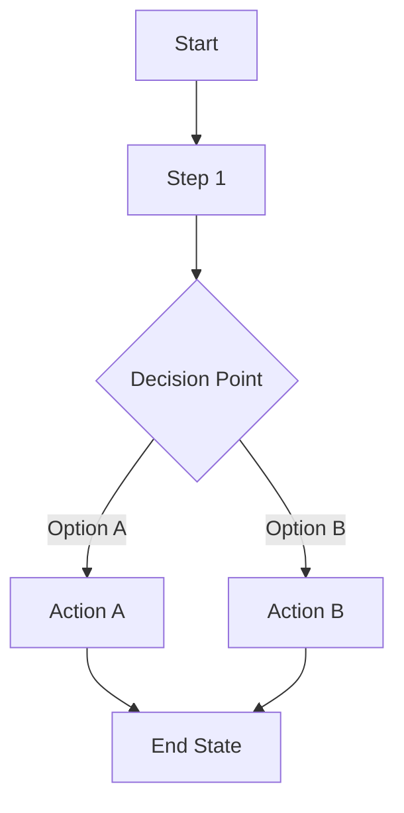

# UXRD: [Feature Name]

## Overview

### One-line Summary

[Describe this UX feature in one line]

### Background

[Why is this UX change needed? What user problem does it solve?]

### Related Documents

- **PRD**: [Link to related PRD]
- **Design Doc**: [Link to related Design Doc - to be created after UXRD approval]

## User Flows

### Primary User Flow

[Describe the main user journey through this feature]



### Alternative Flows

[Describe edge cases and alternative paths]

### Error Flows

[Describe how errors are handled in the user flow]

## Wireframes / Layout

### Screen 1: [Screen Name]

```
+------------------------------------------+
|  Header / Navigation                     |
+------------------------------------------+
|                                          |
|  [Main Content Area]                     |
|                                          |
|  +----------------+  +----------------+  |
|  |   Component 1  |  |   Component 2  |  |
|  +----------------+  +----------------+  |
|                                          |
+------------------------------------------+
|  Footer / Actions                        |
+------------------------------------------+
```

**Layout Notes**:

- [Describe layout behavior and constraints]
- [Spacing and alignment requirements]

### Screen 2: [Screen Name]

[Add additional screens as needed]

## Component Behavior Specifications

### Component 1: [Component Name]

**States**:
| State | Visual | Behavior |
|-------|--------|----------|
| Default | [Description] | [Interaction behavior] |
| Hover | [Description] | [Interaction behavior] |
| Active/Pressed | [Description] | [Interaction behavior] |
| Focus | [Description] | [Keyboard navigation behavior] |
| Disabled | [Description] | [Why and when disabled] |
| Loading | [Description] | [Loading indicator behavior] |
| Error | [Description] | [Error display and recovery] |

**Interactions**:

- **Click/Tap**: [Behavior description]
- **Keyboard**: [Key bindings and behavior]
- **Touch/Gesture**: [Mobile-specific interactions]

### Component 2: [Component Name]

[Add additional components as needed]

## Accessibility Requirements

### WCAG Compliance

- **Target Level**: [WCAG 2.1 AA / AAA]

### ARIA Requirements

| Component     | Role   | aria-label | Other ARIA attributes                |
| ------------- | ------ | ---------- | ------------------------------------ |
| [Component 1] | [role] | [label]    | [e.g., aria-expanded, aria-controls] |
| [Component 2] | [role] | [label]    | [attributes]                         |

### Keyboard Navigation

| Key         | Action                        |
| ----------- | ----------------------------- |
| Tab         | [Focus movement description]  |
| Enter/Space | [Activation behavior]         |
| Escape      | [Dismissal behavior]          |
| Arrow Keys  | [Navigation within component] |

### Screen Reader Considerations

- [Announce state changes]
- [Reading order requirements]
- [Live region specifications]

### Color and Contrast

- [Minimum contrast ratios]
- [Color-blind friendly requirements]
- [Dark mode considerations]

## Responsive Behavior

### Breakpoints

| Breakpoint | Width          | Layout Changes |
| ---------- | -------------- | -------------- |
| Mobile     | < 640px        | [Description]  |
| Tablet     | 640px - 1024px | [Description]  |
| Desktop    | > 1024px       | [Description]  |

### Mobile-Specific Behavior

- [Touch targets: minimum 44x44px]
- [Gesture support]
- [Portrait/Landscape handling]

### Desktop-Specific Behavior

- [Hover states]
- [Keyboard shortcuts]
- [Multi-window considerations]

## Content and Microcopy

### UI Text

| Element            | Text      | Notes                     |
| ------------------ | --------- | ------------------------- |
| Page Title         | [Title]   | [SEO/accessibility notes] |
| Button - Primary   | [Label]   | [Action clarity]          |
| Button - Secondary | [Label]   | [Action clarity]          |
| Error Message      | [Message] | [Recovery guidance]       |
| Empty State        | [Message] | [Next action guidance]    |
| Loading State      | [Message] | [Duration expectations]   |

### Validation Messages

| Field     | Validation | Error Message | Success Message |
| --------- | ---------- | ------------- | --------------- |
| [Field 1] | [Rule]     | [Error text]  | [Success text]  |
| [Field 2] | [Rule]     | [Error text]  | [Success text]  |

### Placeholder Text

| Field     | Placeholder | Notes            |
| --------- | ----------- | ---------------- |
| [Field 1] | [Text]      | [Usage guidance] |

## Design System Integration

### Components from Design System

| Component             | Library Component        | Customization Needed      |
| --------------------- | ------------------------ | ------------------------- |
| [Feature Component 1] | [e.g., shadcn/ui Button] | [None / Variant / Custom] |
| [Feature Component 2] | [e.g., shadcn/ui Dialog] | [None / Variant / Custom] |

### Design Tokens

| Token Type | Token Name          | Value/Usage     |
| ---------- | ------------------- | --------------- |
| Color      | [e.g., primary-500] | [Usage context] |
| Spacing    | [e.g., spacing-4]   | [Usage context] |
| Typography | [e.g., heading-lg]  | [Usage context] |

### Custom Components Required

- [ ] [New component 1]: [Reason why design system doesn't cover this]
- [ ] [New component 2]: [Reason]

## Animation and Transitions

### Transitions

| Element     | Trigger       | Duration      | Easing              | Effect        |
| ----------- | ------------- | ------------- | ------------------- | ------------- |
| [Element 1] | [e.g., hover] | [e.g., 150ms] | [e.g., ease-out]    | [Description] |
| [Element 2] | [e.g., enter] | [e.g., 300ms] | [e.g., ease-in-out] | [Description] |

### Motion Preferences

- **Reduced Motion**: [How animations degrade for prefers-reduced-motion]

## Undetermined Items

- [ ] [Question 1]: [Options or impacts to discuss]
- [ ] [Question 2]: [Options or impacts to discuss]

_Discuss with stakeholders until this section is empty, then delete after confirmation_

## Appendix

### User Research References

- [Link to user research findings]
- [Link to usability test results]

### Design File References

- [Link to Figma/Sketch files if available]

### Glossary

- **Term 1**: [Definition]
- **Term 2**: [Definition]
