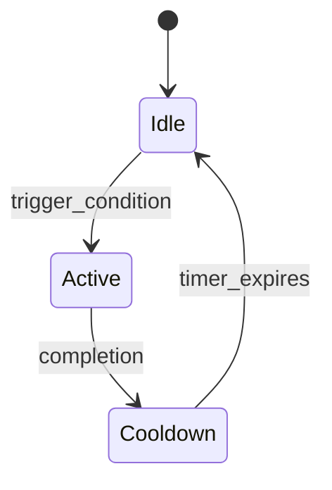

# Mechanic Analysis: [Mechanic Name]

Game: [Game Name]
Generated: [Date]
Analyst: mechanics-developer
Category: Core / Secondary / Meta
Complexity: Low / Medium / High

## Overview

**One-line description**: [What this mechanic does in the game]

**Role in core loop**: [How it fits into the primary gameplay cycle]

**Player motivation**: [Why players engage with this mechanic — mastery, reward, expression, social]

## States & Transitions

### State Machine Diagram



*Replace with actual states*

### State Definitions

| State | Description | Duration | Player Can... | Player Cannot... |
|-------|-------------|----------|---------------|-----------------|
| [State 1] | [Description] | [Duration/Condition] | [Allowed actions] | [Restricted actions] |
| [State 2] | [Description] | [Duration/Condition] | [Allowed actions] | [Restricted actions] |

### Trigger Conditions

| Transition | From → To | Trigger | Conditions | Priority |
|-----------|----------|---------|------------|----------|
| [Name] | [State A → State B] | [Input/Event] | [Prerequisites] | [If conflicts] |

## Math & Formulas

### Core Calculations

```
[Formula Name]:
  result = base_value * multiplier + bonus

  Where:
    base_value = [source]
    multiplier = [scaling factor]
    bonus = [additive component]
```

### Scaling Curves

| Level/Tier | Input Value | Output Value | Growth Type |
|-----------|------------|-------------|-------------|
| 1 | [X] | [Y] | Linear / Exponential / Logarithmic |
| 5 | [X] | [Y] | |
| 10 | [X] | [Y] | |
| Max | [X] | [Y] | |

### Balancing Parameters

| Parameter | Value | Range | Purpose |
|-----------|-------|-------|---------|
| [Param 1] | [Value] | [Min-Max] | [Why this value] |
| [Param 2] | [Value] | [Min-Max] | [Why this value] |

### Economy Integration

- **Resources consumed**: [What this mechanic costs the player]
- **Resources produced**: [What this mechanic gives the player]
- **Net flow**: [Sink / Source / Neutral]
- **Exchange rate**: [How it converts between resource types]

## Player Interaction

### Input → Feedback → Outcome Chain

```
Input: [Player action — tap, hold, swipe, click, key combo]
  ↓
Processing: [What the game calculates]
  ↓
Feedback: [Immediate visual/audio/haptic response]
  ↓
Outcome: [Game state change — damage, movement, resource gain]
  ↓
Consequence: [Long-term impact — progression, unlocks, narrative]
```

### Input Complexity

| Action | Input Type | Timing Window | Skill Expression |
|--------|-----------|---------------|-----------------|
| [Basic] | [Single press] | [Lenient] | Low |
| [Advanced] | [Combo/timing] | [Tight] | High |

### Feedback Quality

| Feedback Type | Implementation | Effectiveness |
|--------------|---------------|---------------|
| Visual | [Screen shake, particles, flash, animation] | [Rating 1-5] |
| Audio | [SFX, music change, pitch variation] | [Rating 1-5] |
| Haptic | [Vibration, rumble patterns] | [Rating 1-5] |
| UI | [Numbers, health bars, notifications] | [Rating 1-5] |

## Edge Cases & Exploits

### Known Edge Cases

| Case | Description | Severity | How Game Handles It |
|------|-------------|----------|-------------------|
| [Case 1] | [What happens] | Low/Med/High | [Clamping, graceful failure, ignored] |

### Degenerate Strategies

| Strategy | Description | Effectiveness | Developer Response |
|----------|------------|---------------|-------------------|
| [Exploit 1] | [How players abuse this] | [How broken it is] | [Patched? Nerfed? Accepted?] |

### Soft-Lock Potential

- **Can this mechanic soft-lock the player?** [Yes/No]
- **If yes**: [Conditions and recovery options]

## Retention Impact

### Engagement Metrics (estimated)

| Metric | Impact | Mechanism |
|--------|--------|-----------|
| Session length | [+/-] [X] min | [Why — e.g., "high-stakes combat extends sessions"] |
| Return rate | [+/-] [X]% | [Why — e.g., "daily cooldown creates appointment mechanic"] |
| Skill ceiling | [Low/Medium/High] | [How mastery expression drives return] |

### Addiction Patterns

- **Variable reward?** [Yes/No] — [Description if yes]
- **Loss aversion?** [Yes/No] — [How losses feel vs gains]
- **FOMO?** [Yes/No] — [Time-limited aspects]
- **Social pressure?** [Yes/No] — [Competitive/cooperative hooks]
- **Sunk cost?** [Yes/No] — [Investment that creates switching cost]

### Habit Loop

```
Cue: [What triggers the player to engage — notification, UI element, game state]
  ↓
Routine: [The mechanic itself — what the player does]
  ↓
Reward: [What the player gets — dopamine hit, progress, social validation]
  ↓
Investment: [What the player puts in — time, resources, identity]
```

## Source Code Patterns (if available)

### Implementation Architecture

- **Pattern used**: [State machine, ECS component, observer, strategy, etc.]
- **File location**: [Path in source code]
- **Key classes/functions**: [Names and responsibilities]

### Code Quality Observations

| Aspect | Assessment | Notes |
|--------|-----------|-------|
| Modularity | [Good/Fair/Poor] | [Is the mechanic isolated or entangled?] |
| Testability | [Good/Fair/Poor] | [Are there unit tests? Can it be tested in isolation?] |
| Performance | [Good/Fair/Poor] | [Any optimization patterns visible?] |
| Extensibility | [Good/Fair/Poor] | [How easy to add variants or modify?] |

### Notable Implementation Details

```
[Code snippet or pseudocode showing interesting pattern]
```

## Lessons for Our Game

### What to Emulate

1. **[Aspect]**: [Why it works and how to adapt it]
2. **[Aspect]**: [Why it works and how to adapt it]

### What to Avoid

1. **[Aspect]**: [Why it fails and what to do instead]
2. **[Aspect]**: [Why it fails and what to do instead]

### Adaptation Ideas

1. **[Idea]**: [How to take this mechanic's strength and apply it differently]
2. **[Idea]**: [How to combine this mechanic with our existing systems]

---
*Data Confidence: [X]%*
*Sources: [List key sources for this mechanic's analysis]*
*Cross-references: [Links to related reports — retention, game-feel, technology]*
