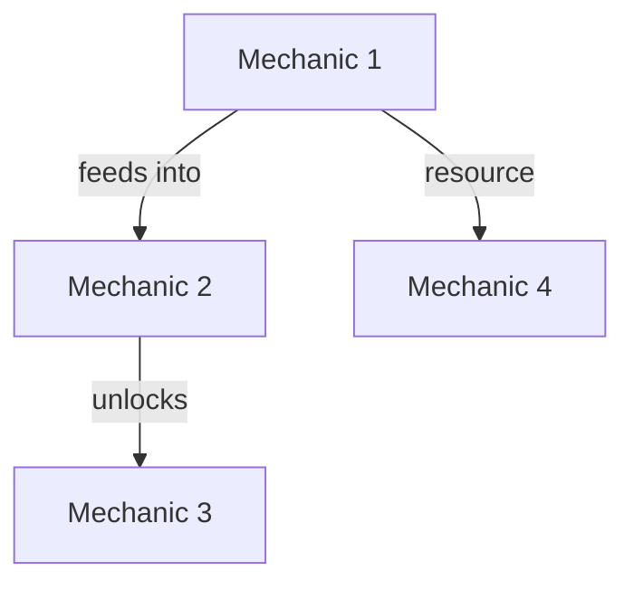

# Mechanics Overview: [Game Name]

Generated: [Date]
Analyst: sr-game-designer
Data Source: raw-research.md

## Core Loop

### Primary Loop Diagram

*Replace with actual core loop structure*

### Loop Metrics

| Metric | Value | Confidence |
|--------|-------|------------|
| Single Loop Duration | [X] minutes | [Tier] |
| Loops per Session | [X] average | [Tier] |
| Loop Variation | [Low/Medium/High] | [Tier] |
| Failure Penalty | [Description] | [Tier] |

### Loop Engagement Drivers

1. **Primary driver**: [What makes the loop compelling]
2. **Secondary driver**: [What adds variety]
3. **Mastery curve**: [How the loop evolves with skill]

## Identified Mechanics

### Mechanics Inventory

| # | Mechanic Slug | Name | Category | Complexity | Retention Impact |
|---|--------------|------|----------|-----------|-----------------|
| 1 | `{slug}` | [Name] | Core / Secondary / Meta | Low/Med/High | Low/Med/High |
| 2 | `{slug}` | [Name] | Core / Secondary / Meta | Low/Med/High | Low/Med/High |
| ... | | | | | |

**Categories**:
- **Core**: Essential to the primary gameplay loop
- **Secondary**: Enhances core loop, not strictly required
- **Meta**: Progression, economy, social systems outside core loop

### System Interconnection Map

*Replace with actual dependencies*

### Interconnection Matrix

| Mechanic | Inputs From | Outputs To | Coupling |
|----------|------------|-----------|---------|
| [Mechanic 1] | — | [M2, M4] | Low |
| [Mechanic 2] | [M1] | [M3] | Medium |
| ... | | | |

**Coupling**: Low (event-based), Medium (shared state), High (direct dependency)

## Progression Systems

### Progression Layers

| Layer | Type | Pacing | Reset? |
|-------|------|--------|--------|
| [Layer 1] | Linear / Branching / Cyclical | [Fast/Medium/Slow] | [Yes/No] |
| [Layer 2] | Linear / Branching / Cyclical | [Fast/Medium/Slow] | [Yes/No] |

### Unlock Gates

| Gate | Requirement | What It Unlocks | Player Motivation |
|------|------------|----------------|-------------------|
| [Gate 1] | [Condition] | [Content/Mechanic] | [Why player pushes through] |
| [Gate 2] | [Condition] | [Content/Mechanic] | [Why player pushes through] |

### Power Curve

- **Early game (0-2 hrs)**: [Power level, available mechanics, content access]
- **Mid game (2-10 hrs)**: [Power growth, new systems, complexity ramp]
- **Late game (10+ hrs)**: [Endgame systems, mastery expression, content treadmill]

## Design Philosophy

### Game Pillars (inferred)

1. **[Pillar 1]**: [Evidence from mechanics]
2. **[Pillar 2]**: [Evidence from mechanics]
3. **[Pillar 3]**: [Evidence from mechanics]

### Design Tensions

| Tension | Side A | Side B | How They Resolved It |
|---------|--------|--------|---------------------|
| [Tension 1] | [e.g., Accessibility] | [e.g., Depth] | [Their approach] |

## Key Findings

### Strengths
1. [What works exceptionally well mechanically]
2. [What creates strong engagement]
3. [What differentiates from competitors]

### Weaknesses
1. [Mechanical pain points]
2. [Missed opportunities]
3. [Player frustration sources]

### Lessons for Our Game
1. [Actionable insight 1]
2. [Actionable insight 2]
3. [Actionable insight 3]

---
*Confidence Level: [X]% based on available data*
*Individual mechanic files: mechanics/{mechanic-slug}.md*
