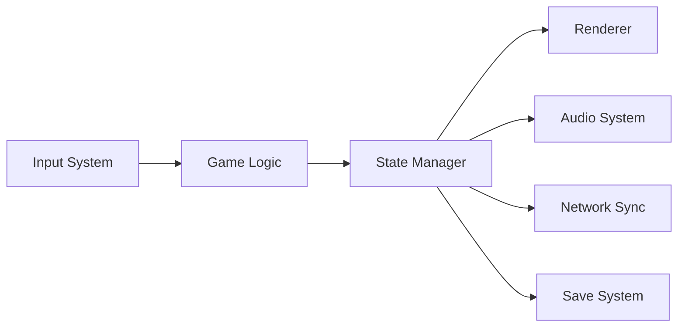

# Technology Analysis: [Game Name]

Generated: [Date]
Analyst: mechanics-developer
Data Source: raw-research.md, source-code/ (if available)

## Technology Stack

### Engine & Framework

| Component | Technology | Version | Confidence |
|-----------|-----------|---------|------------|
| Game Engine | [Unity/Unreal/Godot/Phaser/Custom] | [Version] | [Tier] |
| Language | [C#/C++/TypeScript/GDScript/Rust] | [Version] | [Tier] |
| Rendering | [WebGL/Vulkan/OpenGL/DirectX/Metal] | [API Version] | [Tier] |
| Physics | [Box2D/PhysX/Bullet/Custom] | [Version] | [Tier] |
| Audio | [FMOD/Wwise/Web Audio/Custom] | [Version] | [Tier] |
| Networking | [Photon/Mirror/Netcode/WebSocket/Custom] | [Version] | [Tier] |
| UI Framework | [UGUI/IMGUI/React/Custom] | [Version] | [Tier] |

### Third-Party Integrations

| Service | Purpose | Integration Type |
|---------|---------|-----------------|
| [Service 1] | [Analytics/Ads/IAP/Social] | [SDK/API/Plugin] |
| [Service 2] | [Purpose] | [Type] |

### Platform Support

| Platform | Native/Ported | Performance | Market Priority |
|----------|--------------|-------------|----------------|
| [Platform 1] | [Native/Port] | [Good/Acceptable/Poor] | [Primary/Secondary/Tertiary] |
| [Platform 2] | | | |

## Architecture Analysis

### Module Structure (observed or inferred)

```
[Project Root]
├── [Core Systems]        # Game loop, state management, events
├── [Gameplay]            # Mechanics, entities, AI
├── [Rendering]           # Graphics, effects, camera
├── [UI]                  # Menus, HUD, dialogs
├── [Audio]               # Music, SFX, mixing
├── [Data]                # Save/load, configs, localization
├── [Networking]          # Multiplayer, leaderboards, cloud saves
└── [Platform]            # Platform-specific code, input
```

### Design Patterns Identified

| Pattern | Where Used | Purpose | Effectiveness |
|---------|-----------|---------|---------------|
| [Singleton] | [Game Manager, Audio] | [Global state access] | [Good/Problematic] |
| [Observer/Event Bus] | [Combat, UI] | [Decoupled communication] | [Good/Problematic] |
| [State Machine] | [Player, AI, Game States] | [State management] | [Good/Problematic] |
| [Object Pool] | [Projectiles, Particles, Enemies] | [Performance] | [Good/Problematic] |
| [ECS] | [Entities, Components] | [Composition over inheritance] | [Good/Problematic] |
| [Command] | [Input, Replay, Undo] | [Input buffering] | [Good/Problematic] |

### Data Flow



## Performance Characteristics

### Rendering

| Metric | Value | Assessment |
|--------|-------|-----------|
| Target FPS | [30/60/120/Unlocked] | [Achieves consistently?] |
| Draw Calls | [Estimated count] | [Optimized?] |
| Asset Loading | [Sync/Async/Streaming] | [Loading times] |
| LOD System | [Yes/No] | [Level of detail management] |
| Particle Budget | [Count estimate] | [Impact on performance] |

### Memory & Assets

| Aspect | Approach | Size/Impact |
|--------|---------|-------------|
| Texture Strategy | [Atlases/Individual/Streaming] | [VRAM estimate] |
| Audio Format | [Compressed/Uncompressed/Streaming] | [RAM estimate] |
| Save Data | [Local/Cloud/Both] | [Size estimate] |
| Total Install Size | [Size] | [Platform comparison] |

### Network Performance (if multiplayer)

| Aspect | Implementation | Quality |
|--------|---------------|---------|
| Sync Model | [Client-Server/P2P/Authoritative] | [Reliability] |
| Tick Rate | [Hz] | [Responsiveness] |
| Lag Compensation | [Rollback/Interpolation/None] | [Feel] |
| Bandwidth | [Estimated per player] | [Scalability] |

## Technical Differentiators

### Innovations

1. **[Innovation 1]**: [What makes it technically unique]
   - Implementation: [How it's achieved]
   - Impact: [What it enables for gameplay]

2. **[Innovation 2]**: [Description]
   - Implementation: [Approach]
   - Impact: [Player experience effect]

### Technical Debt Observations

| Area | Issue | Severity | Evidence |
|------|-------|----------|---------|
| [Area 1] | [Description] | Low/Med/High | [How we know] |

## Lessons for Our Game

### Technology Choices to Consider

1. **[Choice]**: [Why and tradeoffs]
2. **[Choice]**: [Why and tradeoffs]

### Performance Patterns to Adopt

1. **[Pattern]**: [How it improves performance]
2. **[Pattern]**: [How it improves performance]

### Mistakes to Avoid

1. **[Mistake]**: [What went wrong and why]
2. **[Mistake]**: [What went wrong and why]

---
*Data Confidence: [X]%*
*Sources: [List sources — Steam page, GitHub repo, developer talks, tool analysis]*
*Cross-references: mechanics/overview.md, game-feel-analysis.md*
