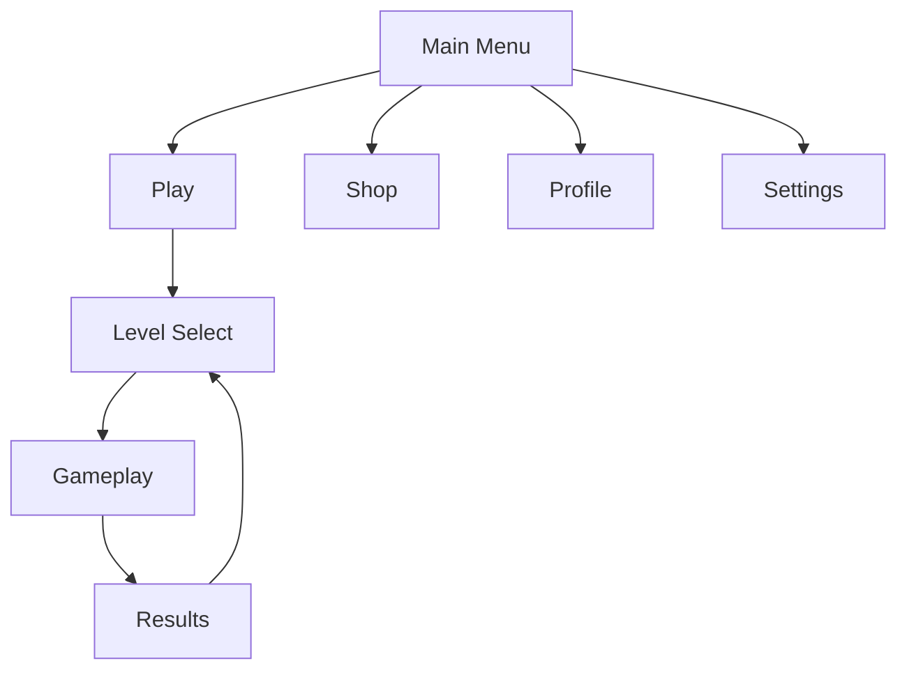

# UI/UX Analysis: [Game Name]

Generated: [Date]
Analyst: ui-ux-agent
Data Source: raw-research.md

## Onboarding & FTUE

### First Launch Sequence

| Step | Screen/Action | Duration | Purpose | Effectiveness (1-5) |
|------|-------------|----------|---------|---------------------|
| 1 | [Splash/Logo] | [Seconds] | [Branding] | [Rating] |
| 2 | [Settings/Permissions] | [Seconds] | [Setup] | [Rating] |
| 3 | [Tutorial start] | [Minutes] | [Learning] | [Rating] |
| ... | | | | |

### Tutorial Design

| Aspect | Approach | Assessment |
|--------|---------|-----------|
| Style | [Guided/Contextual/Sandbox/None] | [Effective/Mixed/Poor] |
| Skippable | [Yes/No/After first play] | [Appropriate?] |
| Length | [Minutes] | [Too long/Right/Too short] |
| Information Density | [Overwhelming/Balanced/Sparse] | [Assessment] |
| Practice Opportunity | [Immediate/Delayed/None] | [Assessment] |
| Failure Handling | [Forgiving/Punishing/N/A] | [Assessment] |

### Onboarding Friction Points

| Friction | Severity | When It Occurs | Player Impact |
|----------|----------|----------------|--------------|
| [Friction 1] | [High/Med/Low] | [Timing] | [Drop-off risk] |

## Navigation Architecture

### Screen Flow Map

*Replace with actual navigation*

### Navigation Depth

| Destination | Taps from Main | Taps from Gameplay | Assessment |
|------------|---------------|-------------------|-----------|
| [Core Action] | [X] taps | [X] taps | [Optimal/Acceptable/Too deep] |
| [Shop] | [X] taps | [X] taps | [Optimal/Acceptable/Too deep] |
| [Settings] | [X] taps | [X] taps | [Optimal/Acceptable/Too deep] |
| [Social] | [X] taps | [X] taps | [Optimal/Acceptable/Too deep] |

### Navigation Pain Points

1. **[Issue]**: [Description and impact on user flow]
2. **[Issue]**: [Description and impact]

## HUD Design

### HUD Elements

| Element | Position | Always Visible | Information Density | Clarity |
|---------|---------|---------------|-------------------|---------|
| [Health/HP] | [Top-left] | [Yes/No/Contextual] | [Minimal/Moderate/Dense] | [Clear/Ambiguous] |
| [Score/Currency] | [Top-right] | [Yes/No/Contextual] | | |
| [Minimap] | [Corner] | [Yes/No/Contextual] | | |
| [Controls] | [Bottom] | [Yes/No/Contextual] | | |

### HUD Principles (inferred)

- **Philosophy**: [Minimal/Information-rich/Contextual/Adaptive]
- **Customizable**: [Yes/No/Partially]
- **Scalable**: [Adapts to screen size?]
- **Colorblind-safe**: [Yes/No/Option available]

### HUD Screenshots Analysis

*Reference specific visual elements and their design choices*

## Interaction Patterns

### Primary Input Model

| Platform | Input Method | Responsiveness | Precision |
|----------|-------------|---------------|-----------|
| [Mobile] | [Tap/Swipe/Virtual pad/Tilt] | [Instant/Slight delay] | [High/Medium/Low] |
| [PC] | [Mouse+KB/Controller] | [Instant/Slight delay] | [High/Medium/Low] |
| [Console] | [Controller] | [Instant/Slight delay] | [High/Medium/Low] |

### Gesture/Action Vocabulary

| Action | Input | Context | Feedback |
|--------|------|---------|---------|
| [Primary action] | [How to do it] | [When available] | [Visual/audio response] |
| [Secondary action] | [How to do it] | [When available] | [Response] |
| [Navigation] | [How to do it] | [Context] | [Response] |
| [Cancel/Back] | [How to do it] | [Context] | [Response] |

## Menu & Shop Design

### Menu System

| Menu | Layout | Loading Time | UX Quality |
|------|--------|-------------|-----------|
| Main Menu | [List/Grid/Radial/Tab] | [Instant/Fast/Slow] | [Polished/Adequate/Rough] |
| Settings | [Categories/Single page] | [Loading] | [Quality] |
| Inventory | [Grid/List/Category tabs] | [Loading] | [Quality] |
| Shop | [Carousel/Grid/Featured+List] | [Loading] | [Quality] |

### Shop UX Patterns

| Pattern | Implementation | Ethicality |
|---------|---------------|-----------|
| Featured Items | [Rotating/Static/Personalized] | [Fair/Manipulative] |
| Currency Obfuscation | [Direct pricing/Virtual currency/Multiple currencies] | [Transparent/Obfuscated] |
| Sale Urgency | [Timer/Limited stock/FOMO elements] | [Honest/Pressuring] |
| Purchase Flow | [Steps to buy] | [Frictionless/Appropriate friction] |

## Information Hierarchy

### Visual Priority

| Priority | Information | How It's Emphasized |
|----------|-----------|-------------------|
| 1 (Highest) | [Core gameplay info] | [Size/Color/Position/Animation] |
| 2 | [Secondary info] | [Method] |
| 3 | [Tertiary info] | [Method] |
| 4 (Lowest) | [Ambient info] | [Method] |

### Typography & Readability

| Context | Font Style | Size | Readability |
|---------|-----------|------|-----------|
| HUD | [Sans-serif/Pixel/Custom] | [Size] | [Good/Acceptable/Poor] |
| Menus | [Style] | [Size] | [Rating] |
| Dialog | [Style] | [Size] | [Rating] |
| Notifications | [Style] | [Size] | [Rating] |

## Accessibility

### Accessibility Features

| Feature | Available | Quality |
|---------|----------|---------|
| Subtitles/Captions | [Yes/No] | [Size options? Speaker ID? Background?] |
| Colorblind Mode | [Yes/No] | [Types supported] |
| Text Size Options | [Yes/No] | [Range] |
| Control Remapping | [Yes/No] | [Full/Partial] |
| Screen Reader | [Yes/No] | [Quality] |
| Difficulty Options | [Yes/No] | [Range] |
| Motion Reduction | [Yes/No] | [Scope] |
| Audio Cues | [Yes/No] | [For visual info?] |

### Accessibility Rating

- **Overall**: [Excellent/Good/Basic/Poor/None]
- **Notable strengths**: [What they do well]
- **Notable gaps**: [What's missing]

## Lessons for Our Game

### UX Patterns to Adopt

1. **[Pattern]**: [What works and why]
2. **[Pattern]**: [What works and why]
3. **[Pattern]**: [What works and why]

### UX Anti-Patterns to Avoid

1. **[Anti-pattern]**: [What fails and why]
2. **[Anti-pattern]**: [What fails and why]

### Accessibility Priorities

1. **[Feature]**: [Why it matters for our audience]
2. **[Feature]**: [Why it matters for our audience]

---
*Data Confidence: [X]%*
*Sources: [List sources — gameplay observation, screenshots, reviews, accessibility databases]*
*Cross-references: game-feel-analysis.md, retention-analysis.md*
