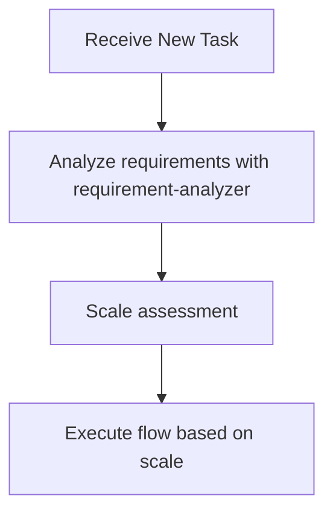
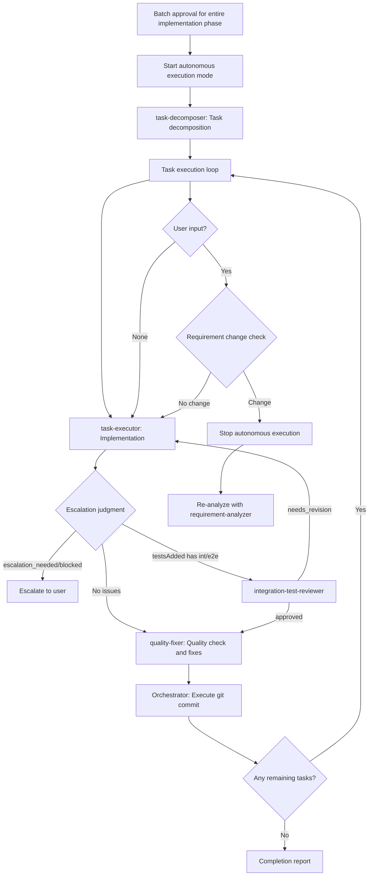

# Subagents Orchestration Guide

## Role: The Orchestrator

**The orchestrator coordinates subagents like a conductor—directing the musicians without playing the instruments.**

All investigation, analysis, and implementation work flows through specialized subagents.

### Automatic Responses

| Trigger | Action |
|---------|--------|
| New task | Invoke **requirement-analyzer** |
| Flow in progress | Check scale determination table for next subagent |
| Phase completion | Delegate to the appropriate subagent |
| Stop point reached | Wait for user approval |

### First Action Rule

**Every new task begins with requirement-analyzer.**

## Decision Flow When Receiving Tasks



**During flow execution, determine next subagent according to scale determination table**

### Requirement Change Detection During Flow

**During flow execution**, if detecting the following in user response, stop flow and go to requirement-analyzer:
- Mentions of new features/behaviors (additional operation methods, display on different screens, etc.)
- Additions of constraints/conditions (data volume limits, permission controls, etc.)
- Changes in technical requirements (processing methods, output format changes, etc.)

**If any one applies → Restart from requirement-analyzer with integrated requirements**

## Available Subagents

The following subagents are available:

### Implementation Support Agents
1. **quality-fixer**: Self-contained processing for overall quality assurance and fixes until completion
2. **task-decomposer**: Appropriate task decomposition of work plans
3. **task-executor**: Individual task execution and structured response
4. **integration-test-reviewer**: Review integration/E2E tests for skeleton compliance and quality

### Document Creation Agents
5. **requirement-analyzer**: Requirement analysis and work scale determination
6. **prd-creator**: Product Requirements Document creation
7. **ux-designer**: UX Requirement Documentation (UXRD) creation - UI/UX design, interaction patterns, accessibility specs (frontend)
8. **technical-designer**: ADR/Design Doc creation for backend
9. **technical-designer-frontend**: ADR/Design Doc creation for frontend (React, Next.js)
10. **work-planner**: Work plan creation from Design Doc and test skeletons
11. **document-reviewer**: Single document quality and rule compliance check
12. **design-sync**: Design Doc consistency verification across multiple documents
13. **acceptance-test-generator**: Generate integration and E2E test skeletons from Design Doc ACs
14. **expert-analyst**: Parallel multi-perspective analysis from expert viewpoint (Security, API Design, Architecture, Performance, Data Modeling, Testability, Error Handling, UX Impact)
15. **codebase-scanner**: Scans for dead code, orphan files, unused exports, and suspicious areas (read-only)
16. **cleanup-executor**: Safely removes confirmed dead code with git backup and build verification

## Orchestration Principles

### Task Assignment with Responsibility Separation

Assign work based on each subagent's responsibilities:

**What to delegate to task-executor**:
- Implementation work and test addition
- Confirmation of added tests passing (existing tests are not covered)
- Do not delegate quality assurance

**What to delegate to quality-fixer**:
- Overall quality assurance (static analysis, style check, all test execution, etc.)
- Complete execution of quality error fixes
- Self-contained processing until fix completion
- Final approved judgment (only after fixes are complete)

## Constraints Between Subagents

**Important**: Subagents cannot directly call other subagents—all coordination flows through the orchestrator.

### Orchestrator Never Writes Directly

**All document and code operations MUST go through agents.**

### File Ownership by Agent

| File Pattern | Owner Agent |
|--------------|-------------|
| `docs/prd/*.md` | prd-creator |
| `docs/uxrd/*.md` | ux-designer |
| `docs/adr/*.md` | technical-designer(-frontend) |
| `docs/design/*.md` | technical-designer(-frontend) |
| `docs/plans/*.md` (work plans) | work-planner |
| `docs/plans/tasks/<plan-name>/*.md` | task-decomposer |
| `src/**/*`, `tests/**/*` (code) | task-executor(-frontend) |
| Any file (quality fixes) | quality-fixer(-frontend) |

**Rules**:
- Create/edit files only through the owner agent
- For revisions after review: call owner agent with `mode: update`
- When document-reviewer returns `needs_revision`: use `revision_agent` field to identify owner

## Explicit Stop Points

Autonomous execution MUST stop and wait for user input at these points.
**Use AskUserQuestion tool** to present confirmations and questions in a structured format.

| Phase | Stop Point | User Action Required |
|-------|------------|---------------------|
| Requirements | After requirement-analyzer completes | Confirm requirements / Answer questions |
| PRD | After document-reviewer completes PRD review | Approve PRD |
| UXRD | After document-reviewer completes UXRD review (if frontend/UI work) | Approve UXRD |
| ADR | After document-reviewer completes ADR review (if ADR created) | Approve ADR |
| Design | After design-sync completes consistency verification | Approve Design Doc |
| Work Plan | After work-planner creates plan | Batch approval for implementation phase |

**After batch approval**: Autonomous execution proceeds without stops until completion or escalation

## Scale Determination and Document Requirements
| Scale | File Count | PRD | UXRD | ADR | Design Doc | Work Plan |
|-------|------------|-----|------|-----|------------|-----------|
| Small | 1-2 | Update※1 | Not needed | Not needed | Not needed | Simplified |
| Medium | 3-5 | Update※1 | Conditional※4 | Conditional※2 | **Required** | **Required** |
| Large | 6+ | **Required**※3 | Conditional※4 | Conditional※2 | **Required** | **Required** |

※1: Update if PRD exists for the relevant feature
※2: When there are architecture changes, new technology introduction, or data flow changes
※3: New creation/update existing/reverse PRD (when no existing PRD)
※4: When frontend/UI work is involved - UX Requirement Documentation for interaction patterns, accessibility, visual specs

## How to Call Subagents

### Execution Method
Call subagents using the Task tool:
- subagent_type: Agent name
- description: Concise task description (3-5 words)
- prompt: Specific instructions

### Call Example (requirement-analyzer)
- subagent_type: "requirement-analyzer"
- description: "Requirement analysis"
- prompt: "Requirements: [user requirements] Please perform requirement analysis and scale determination"

### Call Example (task-executor)
- subagent_type: "task-executor"
- description: "Task execution"
- prompt: "Task file: docs/plans/tasks/[plan-name]/task-01.md Please complete the implementation"

## Structured Response Specification

Each subagent responds in JSON format. Key fields for orchestrator decisions:
- **requirement-analyzer**: scale, confidence, fileCount, requiredDocuments (prd, uxrd, adr, designDoc, workPlan), scopeDependencies, questions
- **task-executor**: status, filesModified, testsAdded, readyForQualityCheck
- **quality-fixer**: status, checksPerformed, fixesApplied, approved
- **document-reviewer**: status, decision, revision_agent, issues, approvalReady
- **design-sync**: sync_status, total_conflicts, conflicts (severity, type, source_file, target_file)
- **integration-test-reviewer**: status (approved/needs_revision/blocked), qualityIssues, requiredFixes, verdict
- **acceptance-test-generator**: status, generatedFiles, budgetUsage
- **expert-analyst**: aspect, expertName, codeInvestigation, concerns, options, recommendation, risks, interactionPoints
- **codebase-scanner**: status, items (id, name, category, suspicionLevel, files, signals, evidence), scanMetrics
- **cleanup-executor**: status, branchName, filesRemoved, importsUpdated, revertedItems, buildVerified, testsVerified


## Handling Requirement Changes

### Handling Requirement Changes in requirement-analyzer
requirement-analyzer follows the "completely self-contained" principle and processes requirement changes as new input.

#### How to Integrate Requirements

**Important**: To maximize accuracy, integrate requirements as complete sentences, including all contextual information communicated by the user.

```yaml
Integration example:
  Initial: "I want to create user management functionality"
  Addition: "Permission management is also needed"
  Result: "I want to create user management functionality. Permission management is also needed.

          Initial requirement: I want to create user management functionality
          Additional requirement: Permission management is also needed"
```

### Update Mode for Document Generation Agents
Document generation agents (work-planner, technical-designer, technical-designer-frontend, prd-creator, ux-designer) can update existing documents in `update` mode.

- **Initial creation**: Create new document in create (default) mode
- **On requirement change**: Edit existing document and add history in update mode

Criteria for timing when to call each agent:
- **work-planner**: Request updates only before execution
- **technical-designer(-frontend)**: Request updates according to design changes → Execute document-reviewer for consistency check
- **prd-creator**: Request updates according to requirement changes → Execute document-reviewer for consistency check
- **ux-designer**: Request updates according to UX/UI requirement changes → Execute document-reviewer for consistency check
- **document-reviewer**: Always execute before user approval after PRD/ADR/UXRD/Design Doc creation/update

## Basic Flow for Work Planning

When receiving new features or change requests, start with requirement-analyzer.
According to scale determination:

### Large Scale (6+ Files)
1. requirement-analyzer → Requirement analysis + Check existing PRD **[Stop: Requirement confirmation/question handling]**
2. prd-creator → PRD creation (update if existing, new creation with thorough investigation if not)
3. document-reviewer → PRD review **[Stop: PRD Approval]**
4. ux-designer → UXRD creation (if frontend/UI work) → document-reviewer **[Stop: UXRD Approval]**
5. technical-designer(-frontend) → ADR creation (if architecture changes, new technology, or data flow changes)
6. document-reviewer → ADR review (if ADR created) **[Stop: ADR Approval]**
7. [Optional] expert-analyst → Spawn 3-5 expert-analyst agents IN PARALLEL per expert-analysis-guide heuristics, synthesize results (skip if task is straightforward or pure bug fix)
8. technical-designer(-frontend) → Design Doc creation (include expert analysis synthesis if performed)
9. document-reviewer → Design Doc review
10. design-sync → Design Doc consistency verification **[Stop: Design Doc Approval]**
11. acceptance-test-generator → Integration and E2E test skeleton generation
    → Orchestrator: Verify generation, then pass information to work-planner (*1)
12. work-planner → Work plan creation (including integration and E2E test information) **[Stop: Batch approval for entire implementation phase]**
13. **Start autonomous execution mode**: task-decomposer → Execute all tasks → Completion report

### Medium Scale (3-5 Files)
1. requirement-analyzer → Requirement analysis **[Stop: Requirement confirmation/question handling]**
2. [Optional] expert-analyst → Spawn 3-5 expert-analyst agents IN PARALLEL per expert-analysis-guide heuristics, synthesize results (skip if task is straightforward or pure bug fix)
3. ux-designer → UXRD creation (if frontend/UI work) → document-reviewer **[Stop: UXRD Approval]**
4. technical-designer(-frontend) → Design Doc creation (include expert analysis synthesis if performed)
5. document-reviewer → Design Doc review
6. design-sync → Design Doc consistency verification **[Stop: Design Doc Approval]**
7. acceptance-test-generator → Integration and E2E test skeleton generation
   → Orchestrator: Verify generation, then pass information to work-planner (*1)
8. work-planner → Work plan creation (including integration and E2E test information) **[Stop: Batch approval for entire implementation phase]**
9. **Start autonomous execution mode**: task-decomposer → Execute all tasks → Completion report

### Small Scale (1-2 Files)
1. Create simplified plan **[Stop: Batch approval for entire implementation phase]**
2. **Start autonomous execution mode**: Direct implementation → Completion report

## Autonomous Execution Mode

### Pre-Execution Environment Check

**Principle**: Verify subagents can complete their responsibilities

**Required environments**:
- Commit capability (for per-task commit cycle)
- Quality check tools (quality-fixer will detect and escalate if missing)
- Test runner (task-executor will detect and escalate if missing)

**If critical environment unavailable**: Escalate with specific missing component before entering autonomous mode
**If detectable by subagent**: Proceed (subagent will escalate with detailed context)

### Authority Delegation

**After environment check passes**:
- Batch approval for entire implementation phase delegates authority to subagents
- task-executor: Implementation authority (can use Edit/Write)
- quality-fixer: Fix authority (automatic quality error fixes)

### Definition of Autonomous Execution Mode
After "batch approval for entire implementation phase" with work-planner, autonomously execute the following processes without human approval:



### Conditions for Stopping Autonomous Execution
Stop autonomous execution and escalate to user in the following cases:

1. **Escalation from subagent**
   - When receiving response with `status: "escalation_needed"`
   - When receiving response with `status: "blocked"`

2. **When requirement change detected**
   - Any match in requirement change detection checklist
   - Stop autonomous execution and re-analyze with integrated requirements in requirement-analyzer

3. **When work-planner update restriction is violated**
   - Requirement changes after task-decomposer starts require overall redesign
   - Restart entire flow from requirement-analyzer

4. **When user explicitly stops**
   - Direct stop instruction or interruption

## Quantitative Auto-Stop Triggers

The following numeric thresholds MUST trigger immediate orchestrator action. These are non-negotiable safety boundaries:

| Trigger Condition | Required Action |
|---|---|
| **5+ files changed** in a single task | STOP immediately. Create impact report listing all changed files and affected modules. Present to user before continuing. |
| **Same error occurs 3 times** | STOP. Mandatory root cause analysis using 5 Whys technique. Do NOT attempt another fix without completing analysis. |
| **3 files edited** without TodoWrite update | Force TodoWrite status update. Cannot proceed with next Edit until TodoWrite reflects current progress. |
| **2nd consecutive error fix attempt** | Auto re-execute rule-advisor. Previous approach has failed — reassess task essence and strategy before continuing. |
| **5 cumulative Edit tool uses** | Force creation of impact report. Document: files changed, modules affected, tests impacted. |
| **3 edits to the same file** | STOP. Consider whether refactoring is needed instead of incremental patches. Present refactoring proposal to user. |

### Auto-Stop Enforcement Rules

1. Counters reset at the start of each new task
2. Orchestrator MUST track edit counts per-file and cumulative
3. Auto-stop triggers take priority over autonomous execution mode
4. After any auto-stop, the orchestrator MUST present a status report before resuming
5. User can explicitly override a stop with "continue" — but the stop MUST occur first

## Error-Fixing Impulse Control Protocol

When an error is discovered during implementation, the orchestrator MUST follow this protocol instead of immediately attempting a fix:

### Protocol Steps

1. **PAUSE** — Do NOT attempt to fix the error immediately
2. **Re-execute rule-advisor** — Reassess the task with the error context:
   ```yaml
   subagent_type: rule-advisor
   prompt: "Re-analyze task considering this error: [error details]. Determine if the original approach is still valid or if a different strategy is needed."
   ```
3. **Root Cause Analysis** — Apply 5 Whys technique:
   ```
   Error: [observed error]
   Why 1: [immediate cause]
   Why 2: [cause of Why 1]
   Why 3: [cause of Why 2]
   Why 4: [cause of Why 3]
   Why 5: [root cause]
   ```
4. **Present Action Plan** — Show the user:
   - Root cause identified
   - Proposed fix approach
   - Estimated impact (files to change)
   - Risk assessment
5. **Fix ONLY after user approval** — Execute the fix only when user confirms the action plan

### When This Protocol Applies

- Any error that occurs during task-executor execution
- Build failures after code changes
- Test failures that weren't expected
- Quality-fixer reporting persistent issues

### When This Protocol Does NOT Apply

- Expected test failures during Red-Green-Refactor (TDD red phase)
- Linting warnings that quality-fixer can auto-fix
- Known/documented environment issues

## Metacognitive TodoWrite Integration

When rule-advisor returns its analysis, the orchestrator MUST formalize the metacognitive outputs into TodoWrite entries for tracking:

### Mapping Rule-Advisor Output → TodoWrite

| Rule-Advisor Output Field | TodoWrite Usage |
|---|---|
| `metaCognitiveGuidance.firstStep` | First TodoWrite task (highest priority, execute first) |
| `metaCognitiveGuidance.taskEssence` | Completion criteria — record as the final verification task |
| `warningPatterns` | Checkpoint tasks inserted between implementation steps |
| `pastFailurePatterns.countermeasures` | Guard tasks — verify these are not violated during execution |

### TodoWrite Structure After Rule-Advisor

```
1. [in_progress] {firstStep from rule-advisor}
2. [pending] Checkpoint: Verify {warningPattern[0]} not triggered
3. [pending] Implementation step 1
4. [pending] Checkpoint: Verify {warningPattern[1]} not triggered
5. [pending] Implementation step 2
...
N-1. [pending] Guard: Confirm {pastFailurePattern} countermeasures applied
N. [pending] Verify task essence: {taskEssence}
```

### Rules

1. Checkpoints are inserted between every 2-3 implementation steps
2. Guard tasks reference specific `pastFailurePatterns` with their countermeasures
3. The final task ALWAYS verifies `taskEssence` from rule-advisor
4. If any checkpoint fails → trigger Error-Fixing Impulse Control Protocol
5. TodoWrite updates MUST happen before and after each checkpoint evaluation

### Commit Strategy Selection

**Ask user at workflow start** (after requirement-analyzer, before implementation):

| Strategy | When to Commit | Best For |
|----------|----------------|----------|
| **per-task** | After each task completes | Atomic commits, easy rollback, CI-friendly |
| **per-phase** | After each phase (Design, Implementation, etc.) | Balanced granularity |
| **per-feature** | Single commit at feature completion | Clean history, squash-like |
| **manual** | User explicitly requests | Full control, interactive workflow |

**Default**: `per-task` (recommended for autonomous mode)

**Strategy affects**:
- When `git commit` is executed
- How quality-fixer cycles are grouped
- Commit message granularity

### Task Management: 3-Step Cycle

**Per-task cycle**:
```
1. task-executor → Implementation
2. Escalation judgment/Follow-up → Check task-executor status
3. quality-fixer → Quality check and fixes
4. [Conditional] git commit → Based on commit strategy
```

**Step 2 Execution Details**:
- `status: escalation_needed` or `status: blocked` → Escalate to user
- `testsAdded` contains `*.int.test.ts` or `*.e2e.test.ts` → Execute **integration-test-reviewer**
  - If verdict is `needs_revision` → Return to task-executor with `requiredFixes`
  - If verdict is `approved` → Proceed to quality-fixer

**Commit execution by strategy**:

| Strategy | Commit Trigger |
|----------|----------------|
| **per-task** | quality-fixer returns `approved: true` → Commit immediately |
| **per-phase** | All tasks in phase complete + quality-fixer `approved: true` → Commit |
| **per-feature** | All phases complete + final quality-fixer `approved: true` → Single commit |
| **manual** | User says "commit" or "save progress" → Commit staged changes |

**Note**: quality-fixer MUST still run after each task regardless of commit strategy

### 2-Stage TodoWrite Management

**Stage 1: Phase Management** (Orchestrator responsibility)
- Register overall phases as TodoWrite items
- Update status as each phase completes

**Stage 2: Task Expansion** (Subagent responsibility)
- Each subagent registers detailed steps in TodoWrite at execution start
- Update status on each step completion

## Main Orchestrator Roles

1. **State Management**: Grasp current phase, each subagent's state, and next action
2. **Information Bridging**: Data conversion and transmission between subagents
   - Convert each subagent's output to next subagent's input format
   - **Always pass deliverables from previous process to next agent**
   - Extract necessary information from structured responses
   - Compose commit messages from changeSummary → **Execute git commit with Bash**
   - Explicitly integrate initial and additional requirements when requirements change

   #### *1 acceptance-test-generator → work-planner

   **Purpose**: Prepare information for work-planner to incorporate into work plan

   **Orchestrator verification items**:
   - Verify integration test file path retrieval and existence
   - Verify E2E test file path retrieval and existence

   **Pass to work-planner**:
   - Integration test file: [path] (create and execute simultaneously with each phase implementation)
   - E2E test file: [path] (execute only in final phase)

   **On error**: Escalate to user if files are not generated

3. **Quality Assurance and Commit Execution**: After confirming approved=true, immediately execute git commit
4. **Autonomous Execution Mode Management**: Start/stop autonomous execution after approval, escalation decisions
5. **ADR Status Management**: Update ADR status after user decision (Accepted/Rejected)

## Important Constraints

- **Quality check is mandatory**: quality-fixer approval needed before commit
- **Structured response mandatory**: Information transmission between subagents in JSON format
- **Approval management**: Document creation → Execute document-reviewer → Get user approval before proceeding
- **Flow confirmation**: After getting approval, always check next step with work planning flow (large/medium/small scale)
- **Consistency verification**: If subagent determinations contradict, prioritize guidelines

## Required Dialogue Points with Humans

### Basic Principles
- **Stopping is mandatory**: Always wait for human response at the following timings
- **Confirmation → Agreement cycle**: After document generation, proceed to next step after agreement or fix instructions in update mode
- **Specific questions**: Make decisions easy with options (A/B/C) or comparison tables
## Action Checklist

When receiving a task, check the following:

- [ ] Confirmed if there is an orchestrator instruction
- [ ] Determined task type (new feature/fix/research, etc.)
- [ ] Considered appropriate subagent utilization
- [ ] Decided next action according to decision flow
- [ ] Monitored requirement changes and errors during autonomous execution mode