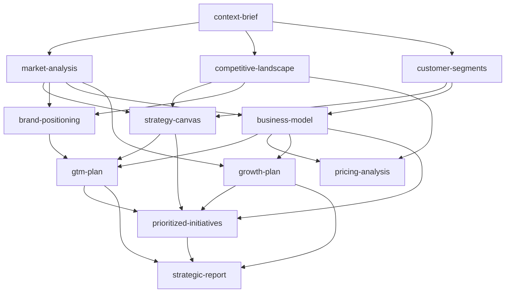

# Strategy Documentation Criteria

## Templates

- **[context-brief-template.md](${CLAUDE_PLUGIN_ROOT}/skills/strategy-documentation-criteria/references/context-brief-template.md)** — Business context extraction
- **[market-analysis-template.md](${CLAUDE_PLUGIN_ROOT}/skills/strategy-documentation-criteria/references/market-analysis-template.md)** — TAM/SAM/SOM market sizing
- **[competitive-landscape-template.md](${CLAUDE_PLUGIN_ROOT}/skills/strategy-documentation-criteria/references/competitive-landscape-template.md)** — Competitor profiles, Porter's, SWOT/TOWS
- **[customer-segments-template.md](${CLAUDE_PLUGIN_ROOT}/skills/strategy-documentation-criteria/references/customer-segments-template.md)** — Segment analysis and attractiveness scoring
- **[strategy-canvas-template.md](${CLAUDE_PLUGIN_ROOT}/skills/strategy-documentation-criteria/references/strategy-canvas-template.md)** — Blue Ocean, Ansoff/BCG, Value Proposition
- **[brand-positioning-template.md](${CLAUDE_PLUGIN_ROOT}/skills/strategy-documentation-criteria/references/brand-positioning-template.md)** — Perceptual maps, positioning statement
- **[business-model-template.md](${CLAUDE_PLUGIN_ROOT}/skills/strategy-documentation-criteria/references/business-model-template.md)** — Lean Canvas / BMC, unit economics
- **[gtm-plan-template.md](${CLAUDE_PLUGIN_ROOT}/skills/strategy-documentation-criteria/references/gtm-plan-template.md)** — ICP, messaging, channels, launch plan
- **[pricing-analysis-template.md](${CLAUDE_PLUGIN_ROOT}/skills/strategy-documentation-criteria/references/pricing-analysis-template.md)** — Value-based pricing, tier structure
- **[growth-plan-template.md](${CLAUDE_PLUGIN_ROOT}/skills/strategy-documentation-criteria/references/growth-plan-template.md)** — AARRR funnel, experiments, 90-day plan
- **[prioritized-initiatives-template.md](${CLAUDE_PLUGIN_ROOT}/skills/strategy-documentation-criteria/references/prioritized-initiatives-template.md)** — ICE/RICE scored master list
- **[strategic-report-template.md](${CLAUDE_PLUGIN_ROOT}/skills/strategy-documentation-criteria/references/strategic-report-template.md)** — Unified McKinsey-grade final report

## Creation Decision Matrix

| Analysis Scope | Required Documents | Creation Order |
|---------------|-------------------|----------------|
| Full Analysis (`/strategy-report`) | All 12 documents | Context → Market (3) → Strategy (2) + Model (1) → GTM (2) + Growth (2) → Report (1) |
| Market Only (`/analyze-market`) | Context + Market + Competitive + Segments | Context → Market (3) |
| Strategy Only (`/strategy-canvas`) | Context + [Market] → Strategy Canvas + Brand Positioning | Prereqs → Strategy (2) |
| Model Only (`/business-model`) | Context + [Market] → Business Model | Prereqs → Model (1) |
| GTM Only (`/gtm-plan`) | Context + [Market] → GTM Plan + Pricing | Prereqs → GTM (2) |
| Growth Only (`/growth-audit`) | Context + [Market] → Growth Plan + Priorities | Prereqs → Growth (2) |
| Competitive Only (`/competitive-map`) | Context → Competitive Landscape | Context → Competitive (1) |
| Pricing Only (`/pricing-strategy`) | Context + [Market] → Pricing Analysis | Prereqs → Pricing (1) |
| Prioritize Only (`/prioritize`) | [All existing docs] → Prioritized Initiatives | Collect → Prioritize (1) |

`[brackets]` = optional but recommended prerequisite

## Document Dependency Chain



## Storage Locations

| Document | Path | Owner Agent | Template |
|----------|------|-------------|----------|
| Context Brief | `docs/strategy/context-brief.md` | context-analyzer | [context-brief-template.md](${CLAUDE_PLUGIN_ROOT}/skills/strategy-documentation-criteria/references/context-brief-template.md) |
| Market Analysis | `docs/strategy/market-analysis.md` | market-analyst | [market-analysis-template.md](${CLAUDE_PLUGIN_ROOT}/skills/strategy-documentation-criteria/references/market-analysis-template.md) |
| Competitive Landscape | `docs/strategy/competitive-landscape.md` | market-analyst | [competitive-landscape-template.md](${CLAUDE_PLUGIN_ROOT}/skills/strategy-documentation-criteria/references/competitive-landscape-template.md) |
| Customer Segments | `docs/strategy/customer-segments.md` | market-analyst | [customer-segments-template.md](${CLAUDE_PLUGIN_ROOT}/skills/strategy-documentation-criteria/references/customer-segments-template.md) |
| Strategy Canvas | `docs/strategy/strategy-canvas.md` | strategy-architect | [strategy-canvas-template.md](${CLAUDE_PLUGIN_ROOT}/skills/strategy-documentation-criteria/references/strategy-canvas-template.md) |
| Brand Positioning | `docs/strategy/brand-positioning.md` | strategy-architect | [brand-positioning-template.md](${CLAUDE_PLUGIN_ROOT}/skills/strategy-documentation-criteria/references/brand-positioning-template.md) |
| Business Model | `docs/strategy/business-model.md` | business-modeler | [business-model-template.md](${CLAUDE_PLUGIN_ROOT}/skills/strategy-documentation-criteria/references/business-model-template.md) |
| GTM Plan | `docs/strategy/gtm-plan.md` | gtm-planner | [gtm-plan-template.md](${CLAUDE_PLUGIN_ROOT}/skills/strategy-documentation-criteria/references/gtm-plan-template.md) |
| Pricing Analysis | `docs/strategy/pricing-analysis.md` | gtm-planner | [pricing-analysis-template.md](${CLAUDE_PLUGIN_ROOT}/skills/strategy-documentation-criteria/references/pricing-analysis-template.md) |
| Growth Plan | `docs/strategy/growth-plan.md` | growth-strategist | [growth-plan-template.md](${CLAUDE_PLUGIN_ROOT}/skills/strategy-documentation-criteria/references/growth-plan-template.md) |
| Prioritized Initiatives | `docs/strategy/prioritized-initiatives.md` | growth-strategist | [prioritized-initiatives-template.md](${CLAUDE_PLUGIN_ROOT}/skills/strategy-documentation-criteria/references/prioritized-initiatives-template.md) |
| Strategic Report | `docs/strategy/strategic-report.md` | report-compiler | [strategic-report-template.md](${CLAUDE_PLUGIN_ROOT}/skills/strategy-documentation-criteria/references/strategic-report-template.md) |

## Quality Standards (All Documents)

### Pyramid Principle (Mandatory)

1. **Governing thought first** — every section opens with the conclusion
2. **Action titles** — section headings are complete sentences stating the main point
3. **Titles test** — reading only titles conveys the full argument
4. **MECE grouping** — arguments at each level are Mutually Exclusive, Collectively Exhaustive

### Source Credibility (Mandatory)

Every data point must be tagged:

| Tier | Description | Usage |
|------|-------------|-------|
| **Tier 1** | Official filings, confirmed metrics, direct data | Hard numbers, quotes |
| **Tier 2** | Industry reports, analyst estimates, reliable press | Market context, trends |
| **Tier 3** | AI estimates, pattern extrapolation, analogies | Gap-fill with disclosure |

**Rule**: Never present Tier 3 as Tier 1. Always disclose estimation methodology.

### Actionability (Mandatory)

Every section must end with:
- **So what?** — Why this matters
- **Now what?** — Specific next actions
- **Confidence** — High / Medium / Low

### Tone

| Do | Don't |
|----|-------|
| "Revenue will reach $2M ARR by Month 18" | "Revenue could potentially grow significantly" |
| "This approach carries three risks" | "There are some concerns" |
| "The data shows 73% preference" | "Most people seem to prefer" |
| Use numbers, percentages, timelines | Use "many", "some", "soon", "significant" |

### Pre-Submission Checklist

```yaml
Structure:
  - Pyramid Principle applied (conclusion first)
  - All categorizations are MECE
  - Action titles on every section
  - Titles test passes

Content:
  - Every data point has source tier tag
  - Every section has "So what?" + "Now what?"
  - Recommendations are specific and actionable
  - Confidence levels stated

Completeness:
  - All template sections filled (no empty placeholders)
  - Risk assessment included
  - Clear next steps with owners and timelines
  - Assumptions explicitly stated
```
